**Spec-Driven Development (SDD) is an engineering practice in which a versioned, reviewable specification — not a prompt and not a ticket — is the source of truth for what software should do.** Architecture, implementation tasks, code and tests are all derived from it, and when something changes, the change re-enters through the specification rather than around it.

That matters more for a Hospital ERP than for most systems. A hospital runs dozens of interlocking domains on a single patient identity, and the defects that hurt live between those domains rather than inside any one of them. AI coding agents can generate the software quickly, but speed does not answer whether the generated system matches what the hospital actually needs — which is a requirements problem, not a coding one.

This article sets out the full hospital domain model, the Spec Kit workflow that turns requirements into durable artifacts, and an Agentic AI architecture in which every hospital AI agent is a specified, permissioned, auditable component with a human approval boundary.

## Key Takeaways

- A Hospital ERP is a federation of clinical, diagnostic, financial and operational domains sharing one patient identity; most serious defects appear at the seams between them.
- AI-generated code does not remove the need for explicit requirements. It raises the cost of leaving them implicit.
- Specifications belong in version control as engineering artifacts, alongside the plan, tasks and tests derived from them.
- Domain-expert and product-owner approval turns a drafted specification into an approved baseline; implementation works from the baseline, not from a conversation.
- AI agents should act through a fixed set of tools under a policy gateway, never through unrestricted database access.
- RAG supplies grounded knowledge, agents supply reasoning and workflow, tools perform actions, and people remain accountable for high-risk decisions.
- Diagnosis, prescribing, triage acuity and final radiology interpretation stay with qualified clinicians at any level of AI capability.
- Traceability from requirement through specification, tasks, code and tests to audit evidence is what makes the result reviewable months later.

### At a glance

| Area | Purpose | AI opportunity | Human oversight |
|---|---|---|---|
| Patient registration | Establish patient identity | Duplicate detection and matching | Required on probable duplicates |
| Appointments | Scheduling and queueing | Slot selection, rescheduling | Not required for routine booking |
| Clinical documentation | SOAP notes and the record | Voice capture, structured drafting | Clinician signature required |
| Laboratory | Diagnostics and analyzers | Workflow coordination, critical-result routing | Technical and pathologist validation |
| Radiology | Imaging and reporting | Screening and worklist prioritisation | Radiologist interprets |
| Pharmacy | Medication workflow | Availability, verification support | Pharmacist and clinician |
| Billing and insurance | Revenue cycle | Explanation, document assembly | Required before submission or adjustment |
| RAG knowledge | Grounded access to policy and SOPs | Cited answers from hospital sources | Required for sensitive decisions |
| AI agents | Workflow execution | Orchestration across domains | Required for every critical action |

---

## 1. The Problem: AI Can Write Code — But Does It Know What Should Be Built?

AI coding agents can generate software remarkably fast.

But speed alone does not solve the hardest engineering problem:

> **Are we building the right thing?**

A Hospital ERP is not a simple application. It is a federation of clinical, diagnostic, operational and financial workflows that share one patient identity and must stay consistent with each other.

### The domain landscape

Grouping the scope by concern makes the coupling visible. Every branch below ultimately hangs off the same patient record.

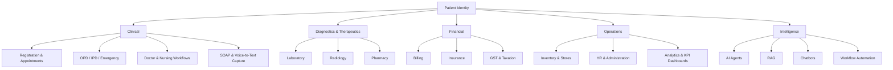

*Figure 1 — Hospital ERP domain landscape. Five concern areas, all anchored to a single patient identity.*

### One patient, many modules

The modules are not independent products. A single outpatient visit crosses most of them in sequence, and each arrow below is a handoff where data, permissions and state must line up.

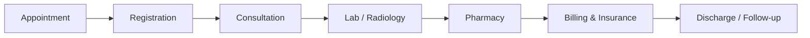

*Figure 2 — A typical outpatient journey. Each handoff is a contract between two modules.*

If the consultation module and the billing module disagree about what "visit closed" means, the defect does not appear in either module's own tests. It appears at the seam between them — which is exactly the kind of agreement a specification is good at pinning down.

When AI agents are involved, the need for clear requirements becomes even more important.

The challenge is therefore not simply:

> **"How can AI write more code?"**

It is:

> **"How can we give AI precise intent, constraints, context and acceptance criteria so that the generated software remains aligned with the business requirement?"**

This is where **Spec-Driven Development (SDD)** becomes valuable.

### Why prompt-driven development struggles here

Prompting an agent directly is effective for small, self-contained changes. It weakens as a system grows, because the intent behind the code lives in a conversation that is not versioned, not reviewable and usually not retained.

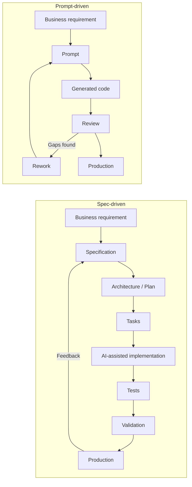

*Figure 3 — The same requirement through both models. In the upper loop, intent is consumed and discarded; in the lower one, it is captured in an artifact that outlives the change.*

The difference is not that one uses AI and the other does not. Both use AI. The difference is where the intent is stored.

| Concern | Prompt-driven | Spec-driven |
|---|---|---|
| Source of intent | The prompt, discarded after use | A versioned specification |
| Ambiguity | Resolved silently by the model | Surfaced and decided by a human |
| First review target | Generated code | The specification, then the code |
| Handling change | Another prompt | A specification update with impact analysis |
| Traceability | Chat history, if retained at all | Git history across spec, plan, tasks and tests |
| Regression risk | Earlier decisions may be forgotten | Earlier decisions remain readable in the artifact |

> **Key insight**
>
> Prompting and specifying both use AI. What differs is whether the reasoning behind a decision survives the change that implemented it.
{: .callout .callout--insight}

---

## 2. Specification Should Be an Engineering Artifact

In traditional development, requirements can easily become scattered across:

- Meetings
- Emails
- Documents
- Tickets
- Conversations
- Developer assumptions

With AI-assisted development, that becomes risky.

An AI agent needs a persistent source of truth that it can repeatedly reference.

That source can be a version-controlled specification.

A specification should describe:

- What needs to be built
- Why it is needed
- Who uses it
- Expected behavior
- Acceptance criteria
- Functional requirements
- Non-functional requirements
- Edge cases
- Constraints
- Dependencies

Once that artifact exists, it stops being a document that is read once and starts being the thing everything else is derived from and checked against.

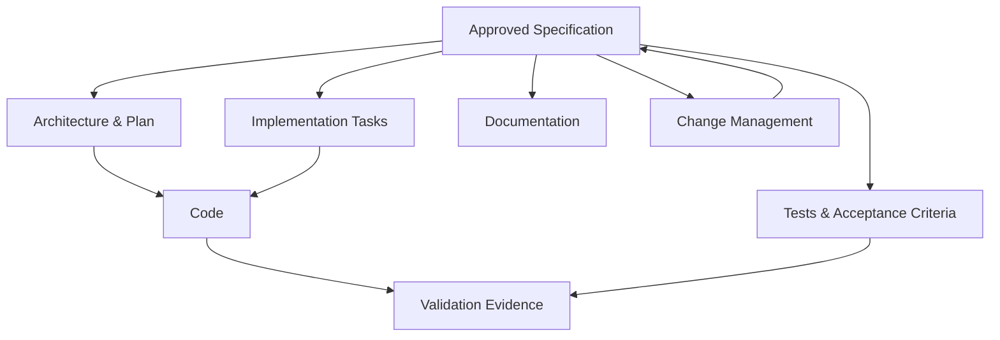

*Figure 4 — The specification as source of truth. Derived artifacts flow outward; changes flow back through it rather than around it.*

The important shift is:

> **The specification is not just documentation. It becomes part of the engineering workflow.**

A practical consequence worth stating early: if a coding agent needs a decision that the specification does not contain, that is a gap in the specification, not a detail for the agent to settle on its own.

---

## 3. GitHub Spec Kit and the Spec-Driven Workflow

[GitHub Spec Kit](https://github.com/github/spec-kit) provides a structured workflow for turning requirements into implementation.

The overall flow can be represented as:

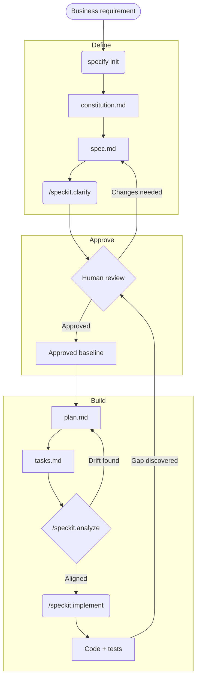

*Figure 5 — The Spec Kit workflow in three phases. Rectangles are artifacts that persist in Git, rounded boxes are commands or activities, diamonds are decisions.*

Three edges in that diagram matter as much as the forward path. Review can send a specification back for changes. Analysis can send drift back to the plan before any code is generated. And a gap discovered during implementation returns to review rather than being settled in place — the rule section 9 sets out in detail.

The important idea is that each stage produces a persistent engineering artifact.

---

## 4. Initialization

The official Spec Kit initialization is performed using the terminal command:

```bash
specify init
```

This initializes the project structure and prepares the environment for the Spec Kit workflow.

It creates the `.specify` area containing project memory, templates and supporting scripts.

> **Important:** `specify init` is the CLI initialization command. The `/speckit.*` commands are agent slash commands used during the development workflow.

---

## 5. Constitution: Establish the Engineering Principles

The first major artifact is the project constitution.

```text
.specify/
└── memory/
    └── constitution.md
```

The constitution defines project-wide principles and constraints.

For a Hospital ERP, this could include principles such as:

- Patient safety
- Security and privacy
- Role-based access control
- Auditability
- Data integrity
- Interoperability
- Reliability
- Performance
- Maintainability
- Human oversight for AI-generated decisions
- Traceability of requirements
- Controlled changes to approved requirements

The constitution answers:

> **"What principles must every feature follow?"**

For example:

```text
Patient data must only be accessible according to the user's
authorized role and permissions.

Clinical AI recommendations must not silently replace
clinician decisions.

Critical workflows must maintain an auditable history of
important actions and changes.
```

These principles can then influence every feature specification and implementation.

---

## 6. Specification: Define What Needs to Be Built

The `/speckit.specify` workflow converts requirements into a structured specification.

For example:

```text
specs/
└── 002-patient-registration/
    └── spec.md
```

The specification can contain:

- Problem statement
- User stories
- Functional requirements
- Non-functional requirements
- Acceptance criteria
- Business rules
- Validation rules
- Error scenarios
- Edge cases
- Dependencies

For example:

```markdown
## User Story

As a registration operator,
I want to register a new patient,
so that the patient can receive hospital services.

## Acceptance Criteria

- The system shall capture mandatory demographic information.
- The system shall validate required fields.
- The system shall prevent duplicate patient registration
  based on configured matching rules.
- The system shall generate a unique patient identifier.
- All registration actions shall be auditable.
```

The goal is to make the intended behavior explicit before implementation begins.

---

## 7. Clarification: Remove Ambiguity Before Coding

Requirements are rarely perfect on the first attempt.

This is where `/speckit.clarify` becomes useful.

Clarification should identify:

- Ambiguous requirements
- Missing business rules
- Conflicting assumptions
- Unclear workflows
- Missing edge cases
- Unspecified roles
- Unclear data behavior

For example:

> Should a patient with an existing record be allowed to create another registration?

That question sounds simple, but it can affect:

- Patient identity
- Medical history
- Billing
- Insurance
- Clinical records
- Reporting
- Compliance
- Duplicate data

AI should not silently guess.

The ambiguity should be surfaced and resolved.

---

## 8. Human-in-the-Loop: Product Owner Review

This is one of the most important governance points.

AI can generate a specification.

But AI should not be the final authority on whether the requirement is correct.

A recommended workflow is:

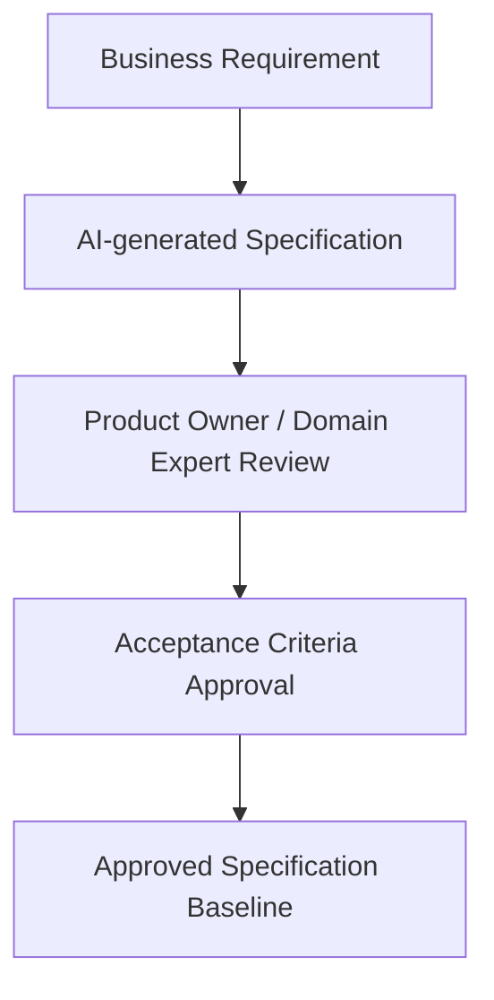

*Figure 6 — Specification approval. AI may draft it; a domain expert decides what becomes the baseline.*

The Product Owner or appropriate domain expert validates:

- Business intent
- Workflow correctness
- Acceptance criteria
- Roles and permissions
- Business rules
- Regulatory considerations
- Clinical or operational implications

Only after this review should the specification become the baseline for implementation.

---

## 9. Freeze the Approved Specification Before Implementation

A useful enterprise governance practice is to **freeze the approved specification as the baseline for that implementation cycle**.

This is not an official Spec Kit command. It is a governance layer that can be applied around the Spec Kit workflow.

Why is this important?

Because an AI coding agent may encounter a gap during implementation.

Without a controlled baseline, there is a risk that the agent could modify the specification to make the implementation appear compliant.

The safer model is:

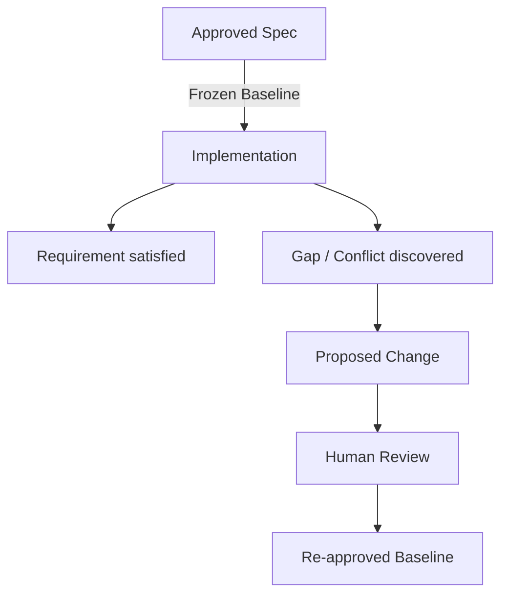

*Figure 7 — A gap discovered during implementation. The baseline moves only through review, never silently.*

The key principle is:

> **If implementation discovers a requirement gap, flag it as a proposed change — do not silently rewrite the source of truth.**

This creates traceability.

---

## 10. Planning: Decide How It Will Be Built

Once the specification is approved, the next step is planning, using `/speckit.plan`.

The plan describes implementation decisions such as:

- Architecture
- Technology choices
- Data model
- APIs
- Contracts
- Integration points
- Security considerations
- Dependencies
- Technical constraints
- Research findings

For example, a patient registration feature may need to define:

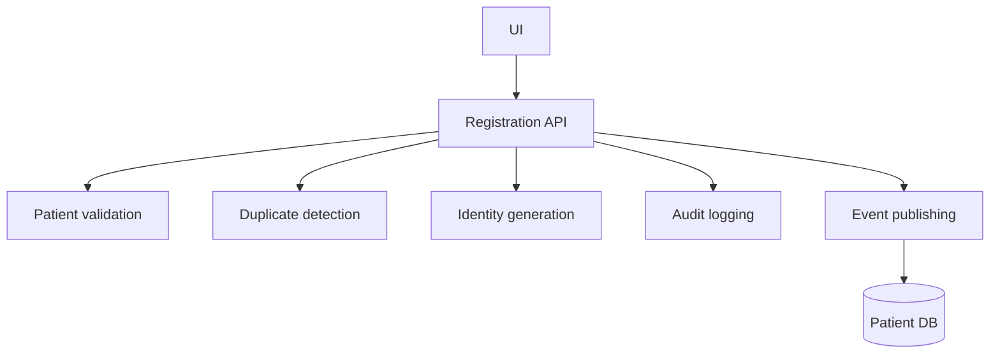

*Figure 8 — Components named by the plan for patient registration.*

The plan answers:

> **"How should the approved requirement be implemented?"**

---

## 11. Tasks: Convert the Plan Into Executable Work

The next step is `/speckit.tasks`.

The plan is converted into actionable, ordered tasks.

For example:

1. Create patient registration database model
2. Implement patient validation service
3. Implement duplicate detection
4. Create registration API
5. Implement registration UI
6. Add audit logging
7. Add authorization checks
8. Add unit tests
9. Add integration tests
10. Validate acceptance criteria

Good tasks should be:

- Actionable
- Testable
- Ordered
- Traceable to requirements
- Small enough for reliable implementation

---

## 12. Analyze: Check for Drift Before Implementation

Before implementation, the workflow can use `/speckit.analyze`.

The purpose is to identify inconsistencies or drift across the engineering artifacts.

Conceptually:

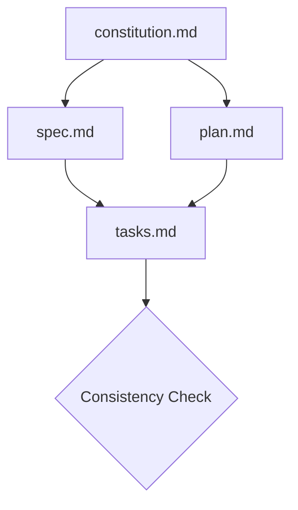

*Figure 9 — Cross-checking constitution, specification, plan and tasks before any code is generated.*

Questions include:

- Does the plan satisfy the specification?
- Do tasks cover the planned work?
- Are requirements missing from the implementation plan?
- Are there contradictions?
- Are constitutional principles being respected?

The analyze stage helps catch problems before code is generated.

---

## 13. Implementation

Only after the specification, plan and tasks are aligned should implementation begin, using `/speckit.implement`.

The AI coding agent can then work from the approved artifacts.

The output includes:

- Source code
- Tests
- Supporting implementation artifacts

The desired relationship is a single traceable chain: requirement, specification, plan, tasks, code, tests. The next section follows one real requirement along the whole of that chain.

---

## 14. Worked Example: Cancelling an Appointment

The workflow above is easier to judge against a single small requirement carried end to end. The example below is illustrative — it is not a statement of any hospital's actual policy.

### Business intent

> A patient should be able to cancel a scheduled appointment themselves, up to a configured cut-off before the appointment time.

Stated that way, the requirement still hides at least four decisions: who else may cancel, what happens to a slot that is released, what the patient is told, and what the hospital must be able to prove afterwards.

### Specification

The specification is where those decisions get made — before any code exists.

```markdown
# REQ-APPT-014 — Patient-initiated appointment cancellation

## User story
As a registered patient,
I want to cancel a scheduled appointment before the cancellation deadline,
so that I do not occupy a slot I cannot attend.

## Acceptance criteria
- AC-1  A patient may cancel only their own appointment, and only while
        its status is `Scheduled`.
- AC-2  Cancellation is permitted until the configured cut-off before the
        appointment start time. The cut-off is configurable per department.
- AC-3  After the cut-off, the patient-initiated cancellation is rejected
        and the patient is directed to contact the hospital.
- AC-4  A successful cancellation releases the slot for rebooking.
- AC-5  The patient receives a cancellation confirmation.

## Business rules
- BR-1  An appointment already marked `CheckedIn`, `Completed` or
        `Cancelled` cannot be cancelled again.
- BR-2  Releasing a slot must not overwrite a booking made in the interim.

## Security constraints
- SC-1  The caller must be authenticated and authorised for the patient
        record referenced by the appointment.
- SC-2  Every cancellation attempt, successful or rejected, is recorded in
        the audit log with actor, timestamp, appointment and outcome.

## Non-functional requirements
- NFR-1 Slot release and appointment status change are applied atomically.
- NFR-2 Confirmation delivery failure must not roll back the cancellation.

## Edge cases
- Concurrent cancellation and reschedule of the same appointment.
- Cancellation attempted exactly at the cut-off boundary.
- Notification channel unavailable.

## Dependencies
- Scheduling (slot inventory), Notifications, Audit, Identity.
```

Two things in that specification are worth noticing. NFR-2 encodes a deliberate trade-off — a failed SMS must not silently undo a cancellation the patient believes succeeded. And SC-2 requires that *rejected* attempts are logged too, which is the kind of requirement that is almost never inferred from a prompt but matters a great deal when someone later asks why a patient was marked absent.

### Design

The plan names the components the change touches, which also defines its blast radius.

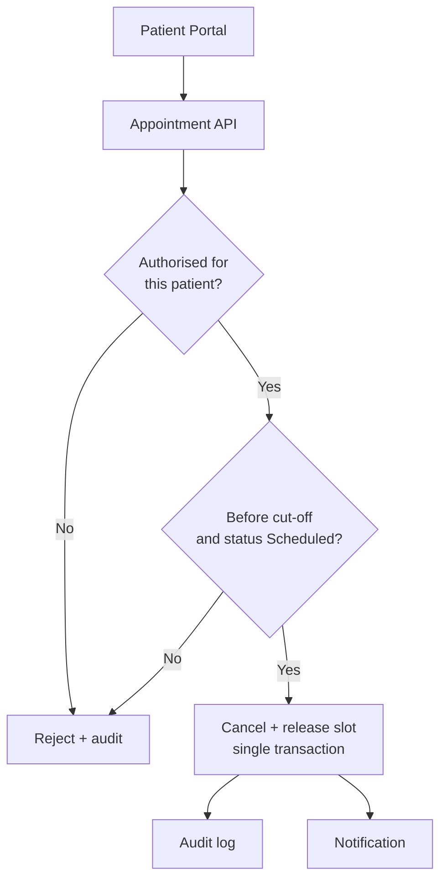

*Figure 10 — Components touched by REQ-APPT-014. Both rejection paths still reach the audit log, as SC-2 requires.*

### Tasks

The plan becomes ordered, individually testable units of work:

| Task | Description | Covers |
|---|---|---|
| T-41 | Add `Cancelled` transition and guard to the appointment state model | AC-1, BR-1 |
| T-42 | Implement per-department cut-off configuration and evaluation | AC-2, AC-3 |
| T-43 | Release slot and update status in one transaction | AC-4, BR-2, NFR-1 |
| T-44 | Emit audit entries for accepted and rejected attempts | SC-2 |
| T-45 | Dispatch confirmation asynchronously | AC-5, NFR-2 |
| T-46 | Authorisation check on the patient record | SC-1 |

### Tests

Acceptance criteria map to named cases, including the ones that must fail:

```text
TC-APPT-014-a  Cancel own Scheduled appointment before cut-off  -> accepted
TC-APPT-014-b  Cancel after cut-off                             -> rejected, audited
TC-APPT-014-c  Cancel another patient's appointment             -> rejected, audited
TC-APPT-014-d  Cancel an already Cancelled appointment          -> rejected
TC-APPT-014-e  Notification provider unavailable                -> cancellation stands
TC-APPT-014-f  Concurrent cancel and reschedule                 -> slot not double-booked
```

Cases b, c and e are the interesting ones. Each corresponds to a line in the specification that a reasonable developer — or a reasonable coding agent — could otherwise have implemented the other way round.

### Traceability

Because every artifact carries an identifier, the chain can be read in either direction: forwards from intent to evidence, or backwards from a line of code to the decision that justifies it.

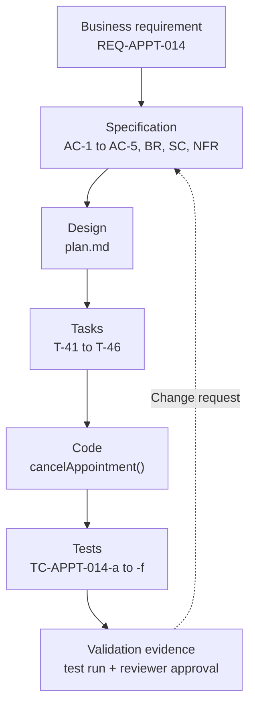

*Figure 11 — Traceability for one requirement. The dotted return path is the only sanctioned route for changing it.*

This is what makes the question "why does the code do that?" answerable months later, by someone who was not in the room.

> **Practical rule**
>
> If a requirement changes, update the specification first — then propagate the change through design, tasks, implementation and tests. A change that enters through the code leaves no trace of why it was made.
{: .callout .callout--rule}

---

## 15. Hospital ERP Repository Structure

A Hospital ERP can be organized around feature-level specifications.

```text
hospital-erp/
│
├── .specify/
│   ├── memory/
│   │   └── constitution.md
│   ├── templates/
│   └── scripts/
│
├── specs/
│   ├── 001-authentication/
│   ├── 002-patient-registration/
│   ├── 003-appointment/
│   ├── 004-emergency/
│   ├── 005-ipd/
│   ├── 006-opd/
│   ├── 007-doctor-workflow/
│   ├── 008-nursing/
│   ├── 009-soap-voice-capture/
│   ├── 010-laboratory/
│   ├── 011-radiology/
│   ├── 012-pharmacy/
│   ├── 013-inventory/
│   ├── 014-billing/
│   ├── 015-insurance/
│   ├── 016-gst-tax/
│   ├── 017-hr/
│   ├── 018-ai-rag/
│   ├── 019-ai-agents/
│   ├── 020-ai-chatbot/
│   ├── 021-analytics/
│   │
│   │   # extended as the domain coverage grew
│   ├── 022-patient-identity/
│   ├── 023-lab-machines/
│   ├── 024-stores/
│   ├── 025-procurement/
│   ├── 026-operating-theatre/
│   ├── 027-blood-bank/
│   ├── 028-cssd/
│   ├── 029-diet-cafeteria/
│   ├── 030-administration/
│   ├── 031-biomedical/
│   ├── 032-facilities/
│   ├── 033-contact-centre/
│   ├── 034-feedback/
│   ├── 035-follow-up/
│   ├── 036-ai-orchestration/
│   ├── 037-ai-voice/
│   ├── 038-ai-governance/
│   ├── 039-ai-observability/
│   ├── 040-ai-incidents/
│   ├── 041-ai-evaluation/
│   ├── 042-reporting/
│   ├── 043-integrations/
│   ├── 044-notifications/
│   ├── 045-audit/
│   ├── 046-rbac/
│   ├── 047-consent/
│   ├── 048-data-governance/
│   ├── 049-security/
│   └── 050-configuration/
│
├── src/
├── tests/
└── docs/
```

Each major capability can have its own `spec.md`, `plan.md`, `tasks.md`, implementation and tests.

This makes the repository more than a codebase.

It becomes a **living engineering knowledge base**.

---

## 16. Why Feature-Level Specifications Matter in a Hospital ERP

Hospital workflows are highly interconnected. Figure 1 showed every domain hanging off a single patient identity, and Figure 2 showed one visit crossing most of them in sequence.

The consequence is that a change to patient identity — a new matching rule, a changed identifier format, a merge of duplicate records — can reach registration, appointments, clinical records, diagnostics, billing, insurance and analytics at once.

Therefore, requirements need to be traceable.

A feature specification can answer:

- What changed?
- Why did it change?
- Which workflow is affected?
- Which APIs are affected?
- Which data model is affected?
- Which tests need updating?
- Which other features depend on it?

This is especially important for enterprise healthcare software.

---

## 17. The Hospital ERP Domain Model

A Hospital ERP is not a collection of screens. It is a set of domains that share a patient identity, a clock, a ledger and an audit trail. Screens are how people reach those domains; they are not the system.

Laying the domains out as layers makes the dependency direction visible. Everything below rests on the identity established above it.

```text
Patient
  ↓
Clinical
  ↓
Diagnostics
  ↓
Therapeutics
  ↓
Operations
  ↓
Finance
  ↓
Insurance
  ↓
People
  ↓
Supply Chain
  ↓
Facilities
  ↓
Patient Experience
  ↓
Analytics
  ↓
AI
  ↓
Governance
```

*Figure 12 — Domain layers. Each layer depends on the correctness of the ones above it, which is why patient identity errors are so expensive.*

Expanded, the domains a working hospital system has to account for are these. The list is long on purpose: the length is the argument for specification.

| Layer | Domains |
|---|---|
| Identity | Authentication, Patient Identity, Consent, RBAC |
| Clinical | Registration, Appointments, OPD, IPD, Emergency, Doctor Workflow, Nursing, SOAP Documentation, Voice-to-Text |
| Diagnostics | Laboratory, Lab Analyzer Management, Radiology (RIS/PACS) |
| Therapeutics | Pharmacy, Operating Theatre, Blood Bank, CSSD |
| Operations | Inventory, Stores, Procurement, Diet and Cafeteria, Biomedical, Facilities |
| Finance | Billing, GST and Tax, Accounts Receivable and Payable |
| Insurance | Payer and TPA, Preauthorization, Claims |
| People | HR, Credentialing, Rostering, Training |
| Patient Experience | Contact Centre, Feedback, Service Recovery, Follow-up |
| Analytics | Reporting, KPI Dashboards, Management Copilot |
| AI | RAG, Agents, Orchestration, Chatbot, Voice |
| Governance | AI Governance, Observability, Evaluation, Incidents, Audit, Data Governance, Security |

Two things follow from this table. First, no single specification can cover a hospital — which is why the repository in section 15 is organised per capability. Second, most of the hard defects live between domains rather than inside them: a patient merged in one domain and not another, a charge posted against a cancelled encounter, a result filed to a closed visit.

> **Key insight**
>
> The domains are not modules to be built in isolation. They are parties to a shared contract about what a patient, an encounter and a charge mean. That contract is the specification's job.
{: .callout .callout--insight}

---

## 18. Clinical Workflows: OPD, IPD and Emergency

Three clinical pathways carry most hospital volume. Each has a different shape, and each fails differently, so each needs its own specification rather than a generic "visit" abstraction.

### Outpatient

```text
Registration
  → Appointment
  → Check-in
  → Queue
  → Consultation
  → SOAP
  → Orders
  → Prescription
  → Pharmacy
  → Billing
  → Follow-up
```

The specification questions here are about time and queue fairness: what happens to a patient who arrives early, what happens to the queue when a doctor runs late, and whether an order placed during consultation can be billed before it is performed.

### Inpatient

```text
Admission
  → Bed
  → Doctor
  → Nursing
  → Orders
  → Diagnostics
  → Pharmacy
  → Procedure
  → Billing
  → Insurance
  → Discharge
```

Inpatient care runs for days, so the hard requirements are about accumulation and state: charges accrue continuously, orders supersede one another, the patient moves between beds and wards, and the bill is provisional until discharge. A specification that treats admission as a single transaction will not survive contact with a ward.

### Emergency

```text
Registration
  → Triage
  → Doctor
  → Orders
  → Treatment
  → Observation
  → Admission / Discharge
```

Emergency inverts the usual order: treatment can begin before identity is fully established, and registration may complete retrospectively. The specification has to permit that inversion explicitly, or staff will work around the system during exactly the moments when the record matters most.

> **Healthcare principle**
>
> Triage acuity is a clinical judgement. A system may present information, prompt for a score, and record who assigned it — but the acuity decision itself stays with a qualified clinician, and no agent described later in this article changes that.
{: .callout .callout--principle}

---

## 19. Nursing

Nursing generates more records per patient-day than any other role, and most of them are time-series rather than documents.

A nursing specification needs to cover ward census and patient assignment, vitals, nursing notes, the Medication Administration Record, intake and output, the care plan, nursing tasks, risk assessments such as fall risk and pressure injury, escalation criteria, and shift handover.

Handover is the highest-risk moment in the list, because information crosses a boundary between two people who are each accountable. It is a good candidate for AI assistance and a poor candidate for AI authority:

```text
Patient Data
  → AI Handover Draft
  → Nurse Review
  → Nurse Approval
  → Handover
```

The draft saves transcription time. The approval step is what makes the handover a nursing record rather than a model output, and the specification should name the nurse who approved it.

---

## 20. Diagnostics: Laboratory, Analyzers and Radiology

### The laboratory is a manufacturing line

A lab order is not a request for a number. It is the start of a physical process with custody, machines and two distinct validation steps.

```text
Lab Order
  → Sample Collection
  → Barcode
  → Accession
  → Sample Validation
  → Analyzer
  → Result
  → Technical Validation
  → Pathologist Validation
  → Report
  → Critical Result
  → Clinician
```

*Figure 13 — The laboratory pathway. Two validations, not one: technical validation checks the run, pathologist validation checks the meaning.*

A specification that stops at "result" misses most of what a lab does. It also needs to cover the machines themselves, which is the part most ERP designs forget.

**Analyzer and machine registry:** manufacturer, model, serial number, location, connectivity and interface status, quality control schedules, calibration, reagent lots, test-to-analyzer mapping, machine queue depth, machine errors and downtime.

**Result lifecycle:** corrected results, critical values, and result versioning. A corrected result is not an edit — the original was already acted on, so both versions must survive with the reason for correction.

When a machine fails, the specification should say what happens rather than leaving it to whoever is on shift:

```text
Analyzer Offline
  → Detect
  → Queue Tests
  → Route to Alternate Analyzer
  → Notify Lab
  → Resume
  → Audit
```

### Radiology

Radiology brings its own standards and its own division of labour: RIS for the workflow, PACS for the images, DICOM as the format, the modality as the source, and accession numbers tying a study to an order.

```text
Imaging Study
  ↓
PACS / DICOM
  ↓
AI Screening
  ↓
Priority
  ↓
Radiologist Review
  ↓
Final Interpretation
```

> **Healthcare principle**
>
> AI screening here supports triage and worklist prioritisation — deciding what a radiologist looks at first. The radiologist remains responsible for the final interpretation. Nothing in this design represents autonomous diagnosis.
{: .callout .callout--principle}

---

## 21. Pharmacy, Inventory, Stores and Procurement

### Pharmacy

```text
Prescription
  → Verification
  → Stock Check
  → Dispensing
  → Billing
  → Inventory Deduction
```

The specification must cover verification against the prescription, availability, batch and expiry selection, dispensing, billing, inventory deduction, returns, and medication safety checks. Batch and expiry are not inventory trivia in a hospital — they are the thread that makes a recall actionable.

### Inventory

Item master, category, unit, batch, lot, serial number, expiry, location; minimum, maximum and reorder levels; reserved, available, damaged and expired stock; and the movements that change them — receipt, issue, transfer, adjustment, return and reconciliation.

The distinction between *reserved* and *available* stock is the one most worth specifying precisely, because it is what stops the same unit being promised to two patients.

### Stores

A hospital does not have one store. It has a central store plus pharmacy, laboratory, operating theatre, ward and emergency stores, each with its own custody and replenishment rules. Transfers between them are inventory movements with an approver, not silent adjustments.

### Procurement

```text
Requirement
  → Purchase Request
  → Approval
  → RFQ
  → Vendor
  → Quotation
  → Purchase Order
  → Goods Receipt
  → Quality Check
  → Stock
  → Invoice
  → Payment
```

*Figure 14 — Procurement lifecycle. Goods receipt and quality check are separate steps; stock that failed inspection must not become available stock.*

---

## 22. Operating Theatre, Blood Bank, CSSD and Diet

### Operating theatre

```text
Surgery Request
  → Approval
  → Scheduling
  → Pre-op
  → Consent
  → Anesthesia
  → OT
  → Surgery
  → Recovery
  → Post-op
  → Billing
  → Discharge
```

The domain covers OT rooms and schedules, the surgical team (surgeon, assistant, anesthetist, nursing), pre-operative assessment, consent, pre-anesthesia evaluation, the surgical safety checklist, implants, the procedure record, PACU and recovery, OT billing, and the awkward realities — cancellations, delays, and emergency cases that displace scheduled ones.

Implant tracking deserves specific attention: an implant is a serial-numbered item that goes into a patient and must remain traceable for years.

### Blood bank

```text
Request
  → Compatibility
  → Cross Match
  → Reserve
  → Issue
  → Transfusion
  → Record
  → Audit
```

Donor, blood group, component, unit, screening, storage, reservation, cross-match, issue, return, transfusion, reaction, expiry and wastage. Traceability from donor to recipient is the defining requirement of the domain, and it is bidirectional — from a unit to the patient who received it, and from a patient back to every unit they were given.

### CSSD

Instrument sets, cleaning, packing, sterilisation, autoclave cycles, chemical and biological indicators, sterility expiry, storage, issue, return, and traceability of a set to the procedure it was used in.

CSSD is where four domains meet: **CSSD ↔ Operating Theatre ↔ Inventory ↔ Infection Control**. A failed sterilisation cycle has to be able to reach every patient exposed to sets from that cycle, which is only possible if the traceability was specified before it was needed.

### Diet and cafeteria

Diet orders, dietician review, diet types, allergies and restrictions, meal plans, kitchen production, ward delivery, patient diet records, staff cafeteria and billing where applicable. Allergy and restriction handling is a patient-safety requirement, not a catering preference.

---

## 23. Finance: Billing, GST and Insurance

### Billing and finance

Estimates, deposits and advances; charges, packages and discounts; invoices, payments, refunds, credit and debit notes; accounts receivable and payable; collections, reconciliation, revenue and profitability.

The specification question that matters most is when a charge becomes final, and who may change it afterwards — which is exactly the worked example in section 14.

### GST and tax

GST with CGST, SGST and IGST splits; HSN and SAC codes; tax categories; inclusive and exclusive pricing; service-to-tax mapping across pharmacy, laboratory and procedures; purchase tax; credit and debit notes; and tax reporting.

Tax must be configuration-driven rather than coded into each module. Rates and mappings change on legislative timelines that have nothing to do with release cycles, and a hospital cannot redeploy its ERP to respond to a notification.

### Insurance and TPA

```text
Eligibility
  → Preauthorization
  → Enhancement
  → Approval
  → Treatment
  → Documentation
  → Claim
  → Query
  → Resubmission
  → Settlement
```

*Figure 15 — The insurance lifecycle. Enhancement and resubmission are loops, not exceptions; a specification that models only the straight path will not match reality.*

Payer, TPA, policy, coverage, exclusions, authorization, denial, appeal and settlement. Denials and queries are normal traffic, so the specification should treat them as first-class states with owners and deadlines rather than error conditions.

---

## 24. People and Plant: HR, Administration, Biomedical and Facilities

### HR and credentialing

Employee records, qualifications, licences, medical registration, credentials and credential expiry, training and mandatory training, attendance, shifts, rostering, leave, payroll integration, performance, onboarding and offboarding.

Credential expiry is the one to specify carefully. A lapsed registration is not an HR inconvenience — it is a clinician who must not be rostered, which makes it a scheduling constraint and an access-control input.

### Administration

Users, roles, permissions, departments, locations, hospitals and branches, master data, configuration, workflow and notification configuration, consent, and identity. This is the domain that determines what every other domain is allowed to do.

### Biomedical

Equipment and device registry, calibration, maintenance, AMC and warranty, breakdowns, preventive maintenance schedules and vendors. It overlaps the lab analyzer registry from section 20 and should share a device identity with it rather than keeping a second list.

### Facilities

Building, floor, room, bed; housekeeping, maintenance, work orders and utilities. Bed is where facilities meets clinical care — the same object is a physical asset to one domain and a patient location to another, and the specification has to say which is authoritative.

---

## 25. Patient Experience

Contact centre and calls, complaints and grievances, feedback, service recovery, patient satisfaction, escalation, messaging over WhatsApp, SMS and email, and follow-up.

Service recovery is worth specifying rather than leaving to goodwill: a complaint has an owner, a clock, an escalation path and an outcome, in the same way a lab order does. Follow-up closes the loop that the outpatient pathway in section 18 opens.

---

## 26. AI Agents Should Also Be Specified

AI agents should not simply be added because:

> "AI can do this."

Each agent should have a clear purpose and boundary.

For example:

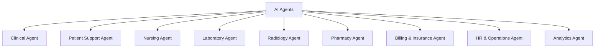

*Figure 16 — Agents as specified components, each with its own purpose, permissions and escalation rules.*

Each agent should have a specification defining:

- Purpose
- Users
- Inputs
- Outputs
- Tools
- Data sources
- Permissions
- Escalation rules
- Human approval requirements
- Failure behavior
- Audit requirements
- Security constraints

The question should not be:

> "Where can we add AI?"

Instead:

> **"Which workflow problem should this agent solve, and what boundaries must it operate within?"**

---

## 27. The Standard Agent Specification

An AI agent is not an LLM prompt with a friendly name, and it is not a chatbot with database access. It is an operational component with a defined responsibility, a fixed set of tools, explicit permissions, an approval boundary and an audit trail. If it cannot be described in those terms, it is not ready to run in a hospital.

Every agent in this architecture is specified with the same template. The template is the point: it turns "we added AI to discharge" into something a reviewer can approve or reject.

```text
Agent
│
├── Purpose                 What problem it solves
├── Business Owner          Who is accountable for its behaviour
├── Users                   Who it acts for
├── Agent Type              Answerer / Summariser / Drafter / Monitor / Workflow
├── Risk Classification     Low / Medium / High
├── Trigger                 What starts it
├── Preconditions           What must be true before it runs
├── Inputs                  Data it receives
├── Context                 Scope of what it may see
├── Knowledge Sources       Versioned RAG collections it may cite
├── Decision / Reasoning    What it is deciding
├── Tools                   The only actions it can take
├── Permissions             Acting as whom, over which records
├── System Actions          Writes it may perform
├── Output                  What it produces
├── Human Approval          Who must approve, and before what
├── Escalation              Where it hands off to a person
├── Exception Handling      What it does when reality disagrees
├── Safety Constraints      What it must never do
├── Audit Events            What is recorded
├── Metrics                 How its usefulness is measured
└── Failure / Recovery      Timeout, retry, fallback, idempotency
```

*Figure 17 — The agent specification template. Fourteen of these fields constrain the agent; only three describe what it produces.*

> **Key insight**
>
> A specification that says what an agent may do is incomplete. The fields that matter most in a hospital are the ones that say what it may not do, who must approve before it acts, and what happens when its tools fail.
{: .callout .callout--insight}

---

## 28. Agent Types

Four categories cover most hospital agents, plus a controlled fifth for agents that change system state. The type determines the default approval posture, which is why it is worth naming before anything else.

| Type | What it does | Approval posture | Examples |
|---|---|---|---|
| Answerer | Returns authorised information, with citations | Usually none | Hospital Knowledge Agent, Policy Agent |
| Summariser | Condenses information the user may already access | Usually none | Patient Summary, Management Summary |
| Drafter | Produces content a human must validate | Always, before the output counts | SOAP, Nursing Handover, Discharge Summary, Insurance Appeal |
| Monitor | Watches conditions and raises actions or exceptions | None to raise; human acts | Critical Result, Discharge Readiness, Bed Flow, Credential Expiry, Claim Denial |
| Workflow / Action | Performs operational actions through tools | Depends on risk; never for clinical decisions | Appointment, Diagnostic Coordination, Inventory Replenishment |

The distinction that does the most work is Drafter versus Workflow. A Drafter's output is inert until a person signs it. A Workflow agent changes the system, so its permissions and idempotency matter more than its prose.

---

## 29. The Hospital AI Agent Catalogue

The agents below are grouped by the domain that owns them. Not every entry is a separate running service — several are capabilities grouped under one domain agent, and the catalogue says so rather than implying thirty independent autonomous systems.

**Patient domain.** Patient Access Agent, Registration Agent, Appointment Agent, Follow-up Agent, Patient Communication Agent.

**Clinical domain.** Clinical Documentation / SOAP Agent, Voice Documentation Agent, Nursing Handover Agent, Diagnostic Coordination Agent, Discharge Summary Agent.

**Diagnostics.** Laboratory Coordination Agent, Critical Result Escalation Agent, Radiology Screening Agent.

**Pharmacy.** Pharmacy Workflow Agent, Medication Availability Agent.

**Finance.** Billing Explanation Agent, Claim Denial Agent, Insurance Preauthorization Agent.

**Operations.** Bed / Queue Flow Agent, Inventory Replenishment Agent, Procurement Agent, Staff Rostering Agent, Facilities / Equipment Agent.

**Patient experience.** Contact Centre Agent, Feedback / Service Recovery Agent.

**Enterprise AI.** Management Copilot, AI Trainer Agent, Knowledge / RAG Agent, AI Governance Agent, AI Observability Agent.

In practice the Registration and Patient Access agents are usually one agent with two entry points, and the Voice Documentation Agent is a capability of the SOAP Agent rather than a peer. Catalogue entries are specification units, not deployment units — the specification decides which are which.

### Specification summary

| Agent | Type | Trigger | Knowledge | Tools | Decision | Human approval | Exception | Audit |
|---|---|---|---|---|---|---|---|---|
| Appointment | Workflow | Patient or staff requests a slot | Department schedules, slot rules | Appointment service | Which slot fits | No, for routine scheduling | No slot → waitlist | Action, actor, timestamp |
| Patient Access | Workflow | New or returning patient | Identity matching rules | Patient registry | Match or create identity | Conditional, on probable duplicate | Ambiguous match → human | Match decision + score |
| SOAP | Drafter | Doctor starts documentation | Encounter context, terminology | Documentation service | How to structure the note | Yes — doctor signs | Poor transcript → flag, no draft | Draft, edits, signature |
| Nursing Handover | Drafter | Shift change | Ward and patient data | Handover record | What to carry forward | Yes — nurse approves | Missing vitals → flagged gap | Draft, approver, time |
| Critical Result | Monitor | Result crosses critical threshold | Critical value ranges | Notification, escalation | Whom to reach, how fast | No, to notify | No acknowledgement → escalate | Every attempt and ack |
| Radiology Screening | Monitor | Study arrives in PACS | Study metadata | Worklist priority | Suggested priority | Radiologist interprets | Low confidence → normal queue | Suggestion vs outcome |
| Diagnostic Coordination | Workflow | Order created | Modality prep rules | Scheduling, messaging | Sequence and logistics | No, for logistics | Machine down → reschedule | Schedule changes |
| Insurance Preauthorization | Drafter | Procedure needs authorisation | Policy, coverage rules | Document assembly | Is the pack complete | Yes — before submission | Missing document → task | Submission and changes |
| Claim Denial | Monitor | Denial received | Payer rules, history | Case queue | Denial reason class | Yes — to appeal | Ambiguous reason → human | Classification + appeal |
| Billing Explanation | Answerer | Patient asks about a bill | Tariff, package rules | Billing read | Which lines to explain | No | Disputed charge → finance | Query and answer |
| Discharge Orchestration | Workflow | Doctor marks likely discharge | Blocker dependencies | Lab, pharmacy, billing, insurance | What blocks discharge | Yes — doctor and billing | Deterioration cancels | Every chase and state |
| Inventory Replenishment | Monitor | Stock crosses reorder level | Consumption history | Purchase request | What to reorder | Yes — above a threshold | Vendor unavailable → alt | Request and approval |
| Credential Expiry | Monitor | Credential nears expiry | HR records | Notification, roster flag | Who is affected | No, to notify | Expired → block rostering | Notice and outcome |
| Management Copilot | Answerer | Manager asks a question | Analytics, permissions | Analytics read | Which evidence answers it | No | Out of scope → refuse | Question and sources |

---

## 30. Agent Specifications in Detail

Six agents, specified at the depth a reviewer needs. These are illustrative designs, not descriptions of a deployed production system.

### Appointment Agent

```text
Type:            Workflow
Risk:            Low
Trigger:         Patient or staff requests an appointment.
Inputs:          Patient, doctor, department, availability, preferences.
Decision:        Identify an appropriate available slot.
Tools:           Appointment service only.
Action:          Create, reschedule or cancel.
Human approval:  Not required for routine scheduling.
Exception:       No suitable slot → waitlist or escalation to the desk.
Safety:          May not override clinical priority or triage.
Audit:           Agent action, acting user, timestamp, slot before and after.
```

### Diagnostic Coordination Agent

```text
Type:            Workflow
Risk:            Medium
Trigger:         Diagnostic order created.
Inputs:          Patient, order, modality, preparation rules, availability.
Decision:        Test sequence and logistics.
Actions:         Schedule test, send preparation instructions, track ETA,
                 notify patient.
Human approval:  Not required for logistics.
Exception:       Delay or machine unavailable → reschedule and notify.
Critical result: Route immediately to the authorised clinician.
Safety:          Transmits a critical result. Does not interpret it,
                 diagnose, or prescribe.
Audit:           Schedule changes, notifications, escalations.
```

### Insurance Preauthorization Agent

```text
Type:            Drafter
Risk:            Medium
Trigger:         Admission or procedure requiring authorisation.
Inputs:          Patient, policy, diagnosis, proposed treatment, documents.
Decision:        Whether the documentation pack is complete and consistent.
Action:          Assemble and prepare the authorisation request.
Human approval:  Required before submission.
Exception:       Missing document → task to the desk. Payer query or
                 rejection → case queue with the reason preserved.
Safety:          Does not assert clinical necessity on its own authority.
Audit:           Every submission, every change, every payer response.
```

### Discharge Orchestration Agent

```text
Type:            Workflow
Risk:            High
Trigger:         Doctor marks a patient as likely to be discharged.

Checks:          Pending investigations, pharmacy, billing, insurance,
                 housekeeping, transport, discharge summary.

Action:          Build the dependency graph, chase blockers, predict
                 readiness, prepare draft documentation.

Human approval:  Doctor   — discharge summary and prescription
                 Billing  — final bill release

Exception:       Clinical deterioration cancels the workflow outright.
                 Payment dispute routes to finance without blocking
                 clinical discharge.
Safety:          Never initiates discharge. It removes obstacles to a
                 discharge a clinician has already judged appropriate.
Audit:           Every blocker, chase, state change and approval.
```

### Radiology Screening Agent

```text
Type:            Monitor
Risk:            High
Trigger:         Imaging study received.
Input:           Study metadata and DICOM-derived information.
Action:          Screening, priority suggestion, worklist prioritisation.
Human:           Radiologist review.
Final reading:   Radiologist, always.
Exception:       Low model confidence → study takes the normal queue
                 position rather than a suggested one.
Safety:          Must not finalise or communicate a diagnosis.
Audit:           Suggested priority, radiologist's actual priority, outcome.
```

### SOAP / Voice Documentation Agent

```text
Type:            Drafter
Risk:            High
Trigger:         Doctor starts clinical documentation.
Input:           Voice transcription and encounter context.
Action:          Structure the information into a SOAP draft.
Human:           Doctor reviews, edits and signs.
Output:          Becomes an official clinical record only after signature.
Exception:       Poor audio or low transcription confidence → surface the
                 transcript and flag it; do not produce a confident draft
                 from unreliable input.
Safety:          Does not add clinical content the encounter did not contain.
Audit:           Transcript, draft, every edit, signature, amendments.
```

---

## 31. RAG for the Hospital

A hospital-wide RAG system can provide grounded access to organizational knowledge.

Potential knowledge sources include:

- Policies
- SOPs
- Clinical guidelines
- Department procedures
- HR policies
- Billing rules
- Insurance documentation
- Training materials
- Hospital-specific operational documentation

A RAG specification should define:

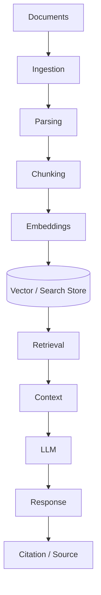

*Figure 18 — A hospital RAG pipeline. Access control and source attribution are requirements, not later additions.*

Important requirements include:

- Access control
- Document versioning
- Source attribution
- Data freshness
- Retrieval quality
- Auditability
- Human escalation
- Protection of sensitive information

---

## 32. Voice-to-Text and SOAP Capture

Another important healthcare AI workflow is voice-enabled clinical documentation.

### What SOAP actually holds

SOAP is not four free-text boxes. Each section has a defined content type, and the specification should say so, because that structure is what makes the note queryable later.

| Section | Content |
|---|---|
| **S**ubjective | Chief complaint, symptoms, history, patient-reported information |
| **O**bjective | Vitals, examination findings, laboratory results, radiology, observations |
| **A**ssessment | Clinical assessment, diagnosis, problem list, differential diagnosis |
| **P**lan | Medication, investigations, procedures, referral, follow-up, instructions |

### The voice pathway

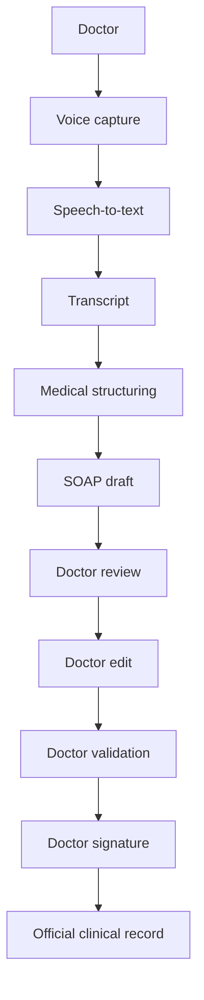

*Figure 19 — The voice pathway. Ten steps, and the record becomes official only at the last one.*

The important principle is:

> **AI should assist documentation; the authorized clinician remains responsible for reviewing and approving the final clinical record.**

Stated as a constraint the system enforces rather than a policy people remember:

> **Healthcare principle**
>
> AI-generated clinical documentation remains a draft until it is reviewed, validated and signed by an authorised clinician. Until signature, it is not part of the clinical record and must not be readable as though it were.
{: .callout .callout--principle}

The specification should define recording behaviour including pause, resume and stop; transcription and its confidence handling; speaker identification where supported; timestamps; medical terminology handling; error handling; editing and review; approval and signature; the audit trail; data retention; and access control.

It should also define **versioning and amendment**. A signed note that is later amended does not overwrite the original — both versions persist, with the author, time and reason for the amendment, because the first version may already have informed a decision.

Where the system supports multiple languages — English and Tamil, for instance, in a Tamil Nadu hospital — the specification should state which languages are supported at capture, whether the structured output is produced in the source language or translated, and which version is the record of truth. Translation quality is a clinical-safety concern, not a localisation preference, so the signed record should be in the language the clinician actually reviewed.

---

## 33. Agent Orchestration and Handoff

Agents do not talk to the hospital directly. Every request passes through the same chain, and each link exists to answer one question.

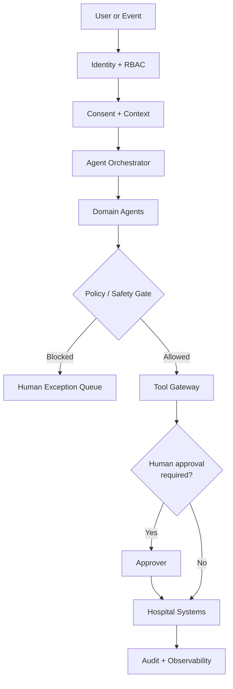

*Figure 20 — The orchestration chain. Identity before context, context before reasoning, policy before tools, approval before writes, audit over everything.*

The domain agents sitting behind the orchestrator mirror the domains from section 17: patient, clinical, diagnostics, pharmacy, finance, insurance, operations, HR and patient experience.

### Agent-to-agent handoff

Real hospital work crosses domains. Discharge is the clearest example, and it shows agents participating in an orchestrated workflow rather than acting as isolated chatbots.

```text
Doctor marks likely discharge
        ↓
Discharge Agent
        ↓
Diagnostic Agent          (any results still pending?)
        ↓
Pharmacy Agent            (take-home medication ready?)
        ↓
Billing Agent             (charges captured?)
        ↓
Insurance Agent           (claim position settled?)
        ↓
Facilities / Transport    (bed turnaround, patient transport)
        ↓
Discharge Summary Agent   (draft prepared)
        ↓
Doctor Approval           ← human
        ↓
Billing Approval          ← human
        ↓
Discharge
```

Each arrow is a specification with its own inputs, exceptions and audit events. The two human checkpoints at the end are not delays in the workflow — they are the workflow's purpose.

---

## 34. Agent Tools, Permissions and Memory

### Tools, not database access

An agent's capability is exactly the set of tools it holds. Nothing else.

```text
Appointment Agent   → Appointment Tool
Lab Agent           → LIS Tool
Radiology Agent     → RIS / PACS Tool
Billing Agent       → Billing Tool
Insurance Agent     → Insurance Tool
Inventory Agent     → Inventory Tool
```

Agents must not have unrestricted database access. Every action routes through a gateway that can refuse it:

```text
Agent → Policy Gateway → Tool Gateway → Authorised System Action
```

The policy gateway decides whether this agent, acting for this user, may take this action on this record. The tool gateway executes it as a bounded operation with its own validation. Separating the two means a compromised or confused agent still cannot exceed its permissions — a defence that matters specifically because prompt injection is a live risk wherever agents read text written by other people.

### Memory and context

Agent memory is scoped deliberately, in four bands:

- **Short-term context** — the current workflow only.
- **Patient context** — only the patient data the acting user is authorised to see.
- **Organisational context** — hospital policies and SOPs.
- **Long-term knowledge** — versioned RAG collections, as described in section 31.

Context must be permission-aware, scoped, tenant-aware, purpose-specific and auditable. An agent inherits the permissions of the person it acts for; it never accumulates a broader view by virtue of having been used by many people.

---

## 35. Human Approval and AI Safety Classification

### The approval matrix

| Agent | Action | Human approval |
|---|---|---|
| Appointment | Schedule | No |
| Patient Access | Registration | Conditional |
| Diagnostic Coordination | Scheduling | No |
| Billing Explanation | Explain a charge | No |
| Insurance | Submit preauthorisation | Yes |
| Billing | Financial adjustment | Yes |
| Discharge | Draft summary | Yes |
| Nursing Handover | Handover | Nurse |
| SOAP | Clinical documentation | Doctor |
| Radiology | AI screening | Radiologist interprets |
| Emergency Triage | Acuity decision | Clinician |
| Diagnosis | Diagnosis | Clinician |
| Prescription | Prescription | Clinician |

For every high-risk workflow the sequence is fixed:

> **AI Recommendation → Human Review → Human Approval → System Action**

### Risk classification

**Low risk.** Appointments, reminders, notifications, FAQ answers, scheduling.

**Medium risk.** Billing explanation, insurance document preparation, operational forecasting, staffing suggestions.

**High risk.** Clinical documentation, nursing handover, critical result escalation, radiology screening, discharge readiness.

**No autonomous decision, at any risk appetite.** Diagnosis, treatment, prescribing, emergency acuity, end-of-life decisions, consent, breaking bad news, final radiology interpretation, and discharge against medical advice.

> **Healthcare principle**
>
> The last list is not a maturity stage to graduate from. These are decisions that require an accountable clinician, and the architecture is built so that no agent can take them regardless of how capable the underlying model becomes.
{: .callout .callout--principle}

---

## 36. Agent Failure, Observability and Evaluation

### Failure and recovery

Every agent needs a timeout, a retry policy, a fallback, a human escalation path, duplicate prevention, idempotency, an audit trail and an explicit failure status.

```text
Agent
  ↓
Tool Failure
  ↓
Retry
  ↓
Retry Exhausted
  ↓
Human Exception Queue
  ↓
Resolution
  ↓
Resume Workflow
```

*Figure 21 — Failure path. The exception queue is a real work queue with an owner, not a log line.*

Idempotency deserves emphasis. An agent that retries a "create appointment" call without an idempotency key books the patient twice, and the second booking looks exactly like a legitimate one.

### Observability

Track agent execution: start and end time, latency, success and failure, tool calls made, model and model version, prompt version, token usage and cost, human approval outcome, escalations, exceptions and the eventual outcome.

Model and prompt version are the fields that make an incident investigable. Without them, "the agent behaved differently last week" is unanswerable.

### Evaluation

Evaluate accuracy, groundedness, citation quality, safety, completeness, hallucination rate, tool-call correctness, policy compliance and human-approval compliance.

The last one is the most hospital-specific: an agent that produces excellent drafts but occasionally writes to the record without approval has failed, however good the drafts were.

---

## 37. RAG, Agents, Tools and People

These four are routinely conflated, and the conflation is where unsafe designs come from.

```text
RAG    → Knowledge
Agent  → Reasoning and workflow
Tool   → Action
Human  → Accountability for high-risk decisions
```

RAG is not an agent: it retrieves and grounds, it does not act. An agent is not "a RAG chatbot": it reasons over context and calls tools under policy. A tool is not an agent: it is a bounded, validated operation. And none of the three is a substitute for the person who is accountable.

The hospital RAG design in section 31 is the knowledge layer these agents cite. It carries the same access control as everything else — retrieval is filtered by what the acting user may see, so an agent cannot launder unauthorised access through a knowledge query.

---

## 38. Agent Governance

Agents are deployed software, so they need the governance ordinary services get, plus a few things ordinary services do not.

An agent registry records, for every agent: owner, agent version, model version, prompt version, tool permissions, risk classification, approval policy, latest evaluation results, incident history, audit configuration, deployment status — and a kill switch with a rollback path.

The kill switch is not a formality. When an agent misbehaves, the question "can we turn this one off without taking down the workflow it participates in?" has to have been answered at specification time, not discovered during an incident.

---

## 39. Requirement to Agent Traceability

Section 14 traced one requirement to its tests. The same chain extends through agents, and this is the central claim of the whole architecture.

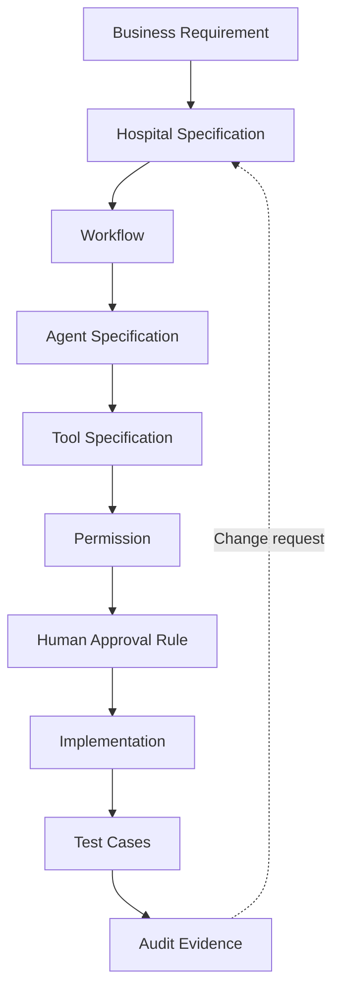

*Figure 22 — Requirement to audit, through the agent. Every link is a reviewable artifact; the dotted path is the only sanctioned way to change one.*

Worked through with a real operational goal:

```text
Requirement:     Reduce discharge delays.
        ↓
Specification:   Discharge readiness, blockers, ownership, SLAs.
        ↓
Agent:           Discharge Orchestration Agent.
        ↓
Tools:           Laboratory, Pharmacy, Billing, Insurance.
        ↓
Approval:        Doctor (summary) + Billing (final bill).
        ↓
Tests:           Each blocker scenario, plus deterioration cancels.
        ↓
Audit:           Every chase, state change and approval traceable.
```

> **Key insight**
>
> In a Hospital ERP, specifications define not only software modules but also the boundaries, responsibilities, permissions, safety controls, workflows, tests and accountability of every AI agent. An agent without a specification is an unreviewed change to clinical operations.
{: .callout .callout--insight}

---

## 40. The End-to-End Agentic Hospital Journey

Putting the catalogue together, one patient's pathway runs through many agents and several human checkpoints. The checkpoints are marked, because they are the design.

```text
Patient
  ↓
Appointment Agent
  ↓
Patient Access Agent
  ↓
Doctor                                    ← human: clinical encounter
  ↓
SOAP / Voice Agent                        → draft
  ↓
Doctor review and signature               ← human: record becomes official
  ↓
Diagnostic Coordination Agent
  ↓
Lab / Radiology
  ↓
Pathologist / Radiologist                 ← human: validation, interpretation
  ↓
Pharmacy Agent
  ↓
Billing Agent
  ↓
Insurance Agent
  ↓
Preauthorisation approval                 ← human: before submission
  ↓
Discharge Orchestration Agent
  ↓
Doctor + Billing approval                 ← human: discharge released
  ↓
Follow-up Agent
  ↓
Feedback Agent
```

Six human checkpoints in one journey. That ratio is the architecture's answer to the question the article opened with: AI accelerates the work between the checkpoints, and never removes one.

---

## 41. Claude Code, Codex, Cursor, Antigravity and Spec Kit

Modern development can combine multiple AI coding environments with Spec Kit.

<div class="tool-strip" role="list">
  <span class="tool" role="listitem">
    <svg class="tool__mark" viewBox="0 0 24 24" aria-hidden="true" focusable="false"><path d="M21 10.5h3v3h-3v3h-1.5v3H18v-3h-1.5v3H15v-3H9v3H7.5v-3H6v3H4.5v-3H3v-3H0v-3h3v-6h18Zm-15 0h1.5v-3H6Zm10.5 0H18v-3h-1.5z"/></svg>
    <span>Claude Code</span>
  </span>
  <span class="tool" role="listitem">
    <span class="tool__mark tool__mark--initial" aria-hidden="true">Cx</span>
    <span>Codex</span>
  </span>
  <span class="tool" role="listitem">
    <svg class="tool__mark" viewBox="0 0 24 24" aria-hidden="true" focusable="false"><path d="M11.503.131 1.891 5.678a.84.84 0 0 0-.42.726v11.188c0 .3.162.575.42.724l9.609 5.55a1 1 0 0 0 .998 0l9.61-5.55a.84.84 0 0 0 .42-.724V6.404a.84.84 0 0 0-.42-.726L12.497.131a1.01 1.01 0 0 0-.996 0M2.657 6.338h18.55c.263 0 .43.287.297.515L12.23 22.918c-.062.107-.229.064-.229-.06V12.335a.59.59 0 0 0-.295-.51l-9.11-5.257c-.109-.063-.064-.23.061-.23"/></svg>
    <span>Cursor</span>
  </span>
  <span class="tool" role="listitem">
    <span class="tool__mark tool__mark--initial" aria-hidden="true">Ag</span>
    <span>Antigravity</span>
  </span>
</div>

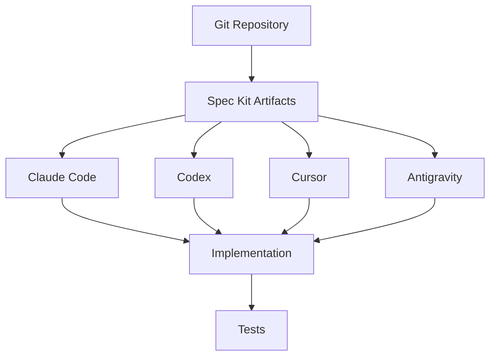

*Figure 23 — The coding environment varies; the artifacts it works from do not.*

The tools may differ, but the source of truth remains the engineering artifacts.

This creates an important separation:

> **The AI tool can change. The specification and governance model should remain stable.**

---

## 42. Git Provides Traceability

Because the artifacts are Markdown files stored in Git, a requirement change is a reviewable diff rather than a recollection.

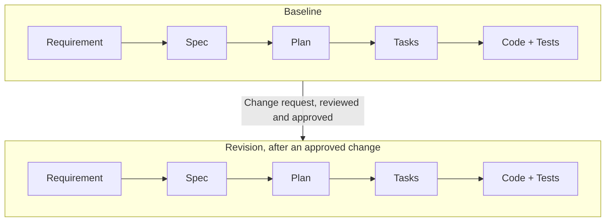

*Figure 24 — The same chain across two revisions. The diff shows not only what changed in the code, but which requirement authorised it.*

This creates a much clearer change history. The practical benefit is that a reviewer can ask "which requirement does this commit serve?" and get an answer from the repository rather than from memory.

---

## 43. Requirements Will Change — and That Is Normal

A frozen baseline does not mean requirements can never change.

Healthcare systems evolve because of:

- Business changes
- Regulatory changes
- Operational feedback
- New integrations
- User feedback
- Security requirements
- New technology
- Clinical workflow changes

The correct approach is controlled change.

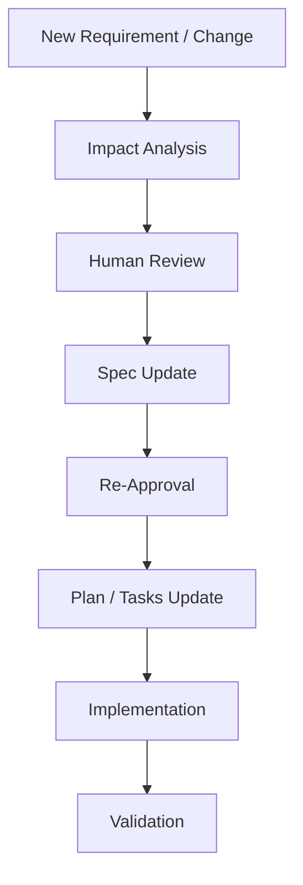

*Figure 25 — Controlled change. Impact analysis and re-approval come before implementation.*

The principle is:

> **Change deliberately, not silently.**

---

## 44. Human-in-the-Loop Is Not a Bottleneck

Human review is sometimes described as slowing AI development.

I see it differently.

In high-impact systems, human review is a quality and governance mechanism.

Splitting the work by who is accountable — rather than by who is faster — makes the boundaries concrete:

| Activity | Human | AI assistance | Automated validation |
|---|---|---|---|
| Requirement analysis | Decides | Drafts, surfaces ambiguity | — |
| Specification approval | Approves the baseline | Drafts, proposes criteria | Consistency checks across artifacts |
| Architecture | Decides | Proposes options, trade-offs | — |
| Implementation | Reviews | Generates code | Build, lint, type checks |
| Tests | Defines intent and coverage | Generates cases | Executes on every change |
| Clinical and safety decisions | Owns | Not delegated | — |
| Security approval | Owns | Flags candidate issues | Scanning, policy checks |
| Risk acceptance and compliance | Owns | Not delegated | — |

The rows with no AI column are the point. They are not tasks that a better model eventually absorbs; they are decisions that require someone accountable for the outcome.

> **Healthcare principle**
>
> AI can assist with drafting, implementation and analysis. Responsibility for clinical intent, safety requirements, security and governance remains with qualified people and organisational process.
{: .callout .callout--principle}

The goal is not to remove humans.

The goal is to make humans **more effective**.

---

## 45. A More Mature Development Loop

The resulting development model is the loop this article has traced. Requirements become a specification. Clarification and human approval turn that specification into a baseline. Plan and tasks derive from the baseline, analysis checks them against it, implementation produces code and tests, and validation closes the loop. When something has to change, it re-enters through the specification rather than around it.

This is more than an AI coding workflow.

It is an **engineering governance model for AI-assisted development**.

---

## 46. Integration Architecture

A Hospital ERP is never the only system in the building. The specification has to name what it talks to, and be honest about the maturity of each connection.

| Area | Interfaces |
|---|---|
| Clinical | HIS, EMR, HL7, [FHIR](https://www.hl7.org/fhir/) |
| Laboratory | LIS, analyzer interfaces |
| Imaging | RIS, PACS, DICOM |
| Finance | Accounting systems, payment gateways |
| Insurance | Payer and TPA portals |
| Communication | SMS, email, WhatsApp |
| HR | Payroll, biometric attendance |
| AI | LLM serving, RAG, speech-to-text, model hosting |

Every integration in a specification should carry a maturity label — **implemented**, **prototype**, **planned** or **external** — and the label should be accurate. Describing a conceptual interface in the same language as a running one is how an architecture diagram becomes a liability during procurement or an audit.

> **Practical rule**
>
> Do not claim a real integration where only a conceptual one exists. A specification that marks an interface "planned" is more useful than one that implies it already works, because the first one can be scheduled and the second one cannot be trusted.
{: .callout .callout--rule}

---

## 47. Error Scenarios

Hospital software is judged on its bad days. Each scenario below deserves a specified path, and the path has the same five parts every time:

```text
Detection → Action → Escalation → Recovery → Audit
```

The scenarios worth specifying explicitly: duplicate patient records; appointment no-show and cancellation; bed unavailable; sample rejected; analyzer offline; critical result; corrected result; medicine out of stock; expired medicine; insurance rejection and payer query; payment failure, duplicate payment and refund; network failure; AI service unavailable; integration unavailable; unauthorised access attempt; and partial workflow completion.

The last one is the most commonly under-specified. A workflow that fails halfway leaves the hospital in a state no screen was designed to display — a patient discharged in the clinical system but not the billing one, or stock deducted for a dispense that never happened. Specifying the compensating action is what makes that state recoverable rather than permanent.

Worth noting for the agent architecture: **AI unavailable** must degrade to the manual pathway, not to a blocked workflow. If the SOAP agent is down, the doctor types the note. An agent that becomes a single point of failure for clinical documentation has been specified wrongly.

---

## 48. Analytics and the Management Copilot

The analytics layer answers operational questions with evidence rather than assertion. Realistic questions a Management Copilot should handle:

- Why did discharge turnaround time increase this month?
- Which departments have the highest queue times?
- What caused claim rejections to rise?
- Which lab analyzers have the highest downtime?
- Which medications are approaching expiry?
- What is today's bed occupancy by ward?
- Which AI agents have the highest failure or escalation rate?

Two constraints make this an Answerer agent rather than a dashboard with a chat box. It must cite the evidence behind an answer, so a manager can check it. And it must respect data permissions — the copilot sees what the person asking is entitled to see, which means an aggregate that would disclose individual patient data to an unauthorised viewer must be refused rather than rounded.

The last question in that list is deliberately recursive: the agents are part of hospital operations, so their reliability is an operational metric like any other, drawing on the observability data from section 36.

---

## 49. Testing the Specification and the Agents

Section 14 showed acceptance criteria becoming test cases. Agents extend that ladder rather than replacing it.

```text
Requirement Test
  ↓
Specification Test
  ↓
Workflow Test
  ↓
Agent Test
  ↓
Tool Test
  ↓
Safety Test
  ↓
Human Approval Test
  ↓
Integration Test
  ↓
End-to-End Test
  ↓
Audit Verification
```

*Figure 26 — The testing ladder. The bottom rung verifies that the audit trail actually recorded what the layers above it did.*

Agent-specific tests, each of which should exist for every agent in the catalogue:

- **Trigger** — it starts when it should, and not otherwise.
- **Context** — it sees only what the acting user may see.
- **Tool correctness** — it calls the right tool with the right arguments.
- **Permission enforcement** — a forbidden action is refused at the gateway, not merely avoided by the model.
- **Refusal** — it declines out-of-scope and unsafe requests, including ones embedded in text it reads.
- **Escalation** — it hands off to a person at the specified boundary.
- **Human approval** — it cannot complete an approval-gated action without the approval.
- **Duplicate prevention and idempotency** — a retry does not double-book, double-dispense or double-charge.
- **Timeout, retry and recovery** — failures land in the exception queue with state intact.
- **Audit** — every one of the above leaves the specified record.

The permission and refusal tests deserve particular weight. They are the tests that verify the architecture rather than the model, and they should still pass when the model is replaced.

---

## 50. Healthcare Concerns the Specification Has to Carry

General-purpose specifications tend to describe the happy path. Healthcare systems fail in the other direction: the hard requirements are about access, evidence and what happens when something breaks midway.

These concerns belong in the specification rather than in a reviewer's head, because they are exactly the requirements a coding agent cannot infer from a feature description.

| Concern | What the specification must answer | Example |
|---|---|---|
| Authentication and authorisation | Who may perform this action, on whose record, in which state? | Only the treating clinician or a delegated nurse may sign a SOAP note |
| Least privilege | What is the narrowest role that can complete the task? | A billing clerk can read a diagnosis code without reading clinical notes |
| Audit logging | Which events must be recorded, with what fields, for how long? | Both accepted and rejected access attempts on a patient record |
| Sensitive data | What is stored, what is displayed, what is exported? | Masking identifiers in analytics and non-clinical exports |
| Data minimisation | Does this workflow need the data it is asking for? | A queue display showing a token number rather than a name and diagnosis |
| Transaction consistency | What must succeed or fail together? | Stock decrement and dispensing record in pharmacy |
| Failure handling | What is the correct behaviour when a dependency is unavailable? | Lab interface down: queue the order, never silently drop it |
| Recovery and availability | What degraded mode is acceptable, and who is told? | Emergency registration continues when the insurance service is unreachable |
| Auditability of the build | Can a given behaviour be traced to an approved requirement? | Requirement → decision → implementation → test → evidence |

On regulation, the honest position is a conditional one. Requirements differ by jurisdiction, by deployment model and by the categories of data a hospital actually processes.

> **Healthcare principle**
>
> Applicable privacy and security obligations depend on jurisdiction and deployment environment. Those obligations should be identified with qualified advice and then written into the specification as explicit, testable requirements — not assumed to be satisfied because a framework was used.
{: .callout .callout--principle}

The engineering value of writing them down is narrow but real: a requirement expressed as an acceptance criterion can be tested, and a tested requirement can be evidenced. That is a precondition for an audit conversation, not a substitute for one.

---

## 51. What Spec-Driven Development Does Not Solve

A methodology is easier to trust when its limits are stated plainly. Spec-Driven Development does not, on its own, guarantee any of the following.

- **Correct requirements.** A specification records a decision; it does not tell you the decision was right. A precisely specified misunderstanding is still a misunderstanding, and it will now be implemented consistently.
- **Correct clinical intent.** Clinical workflows have to be validated by clinicians. No artifact structure substitutes for that review.
- **Secure software.** Writing a security constraint into a specification does not implement it, test it, or keep it true after the next change.
- **Regulatory compliance.** Traceability can support an audit. It does not establish compliance, and no tool can assert compliance on a hospital's behalf.
- **Good architecture.** A detailed specification can be paired with a poor design. Architectural judgement remains a human skill.
- **Defect-free generated code.** AI-generated implementations still need review, testing and, at times, rejection.
- **Successful delivery.** Adoption, training, data migration, integration with existing hospital systems and operational change management decide more outcomes than methodology does.

There is also a cost worth naming. Specifications take effort to write, review and keep current. A specification that has drifted from the running system is worse than none, because people trust it. Sustaining the practice requires that updating the specification stays part of the definition of done.

> **The balanced claim**
>
> Better specifications improve the conditions for reliable AI-assisted engineering. Human expertise, validation, testing, security controls and governance remain essential.
{: .callout .callout--insight}

---

## 52. The Bigger Idea

The real opportunity with AI-assisted software development is not simply generating code faster.

It is creating a stronger connection between business intent and everything downstream of it — requirements, specification, architecture, tasks, implementation, testing and validation.

When these artifacts are connected and version controlled, AI agents become much more useful.

They are no longer operating from a vague prompt.

They are operating within a defined engineering system.

---

## 53. Final Takeaway

For a Hospital ERP, the combination of:

- Spec-Driven Development
- GitHub Spec Kit
- AI coding agents
- Persistent Markdown artifacts
- Git version control
- Human-in-the-loop review
- Approved specification baselines
- Automated consistency analysis
- Automated implementation and testing
- Healthcare-specific governance

can create a much more disciplined way of building complex software.

The goal is not:

> **AI replaces software engineering.**

The goal is:

> **AI accelerates software engineering while humans retain control over intent, decisions, quality and accountability.**

And for healthcare, that distinction matters.

---

## Clear Specs. Smarter Development. Better Healthcare.

**Joe Nishanth**
*AI Agents Developer*
*Healthcare | AI | Automation | Real Impact*

---

## References

- [Examine GitHub Spec Kit commands and results](https://learn.microsoft.com/en-us/training/modules/spec-driven-development-github-spec-kit-greenfield-intro/8-examine-github-spec-kit-commands-results?pivots=video) — Microsoft Learn documentation covering Spec Kit commands, workflow stages and generated artifacts.
- [Explore GitHub Spec Kit workflows and optional commands](https://learn.microsoft.com/en-us/training/modules/spec-driven-development-github-spec-kit-enterprise-developers/3-examine-github-spec-kit) — Microsoft Learn material covering Spec Kit workflows and optional commands.
- [Diving Into Spec-Driven Development With GitHub Spec Kit](https://developer.microsoft.com/blog/spec-driven-development-spec-kit/) — Microsoft's overview of Spec-Driven Development and GitHub Spec Kit.
