## 1. The Problem: AI Can Write Code — But Does It Know What Should Be Built?

AI coding agents can generate software remarkably fast.

But speed alone does not solve the hardest engineering problem:

> **Are we building the right thing?**

A Hospital ERP is not a simple application. It spans interconnected workflows such as:

- Patient registration
- Appointment management
- Emergency
- OPD and IPD
- Doctor workflows
- Nursing
- SOAP documentation
- Voice-to-text clinical capture
- Laboratory
- Radiology
- Pharmacy
- Inventory and stores
- Billing
- Insurance
- GST and taxation
- HR and administration
- Analytics and KPI dashboards
- AI agents
- RAG
- Chatbots
- Workflow automation

When AI agents are involved, the need for clear requirements becomes even more important.

The challenge is therefore not simply:

> **"How can AI write more code?"**

It is:

> **"How can we give AI precise intent, constraints, context and acceptance criteria so that the generated software remains aligned with the business requirement?"**

This is where **Spec-Driven Development (SDD)** becomes valuable.

---

## 2. Specification Should Be an Engineering Artifact

In traditional development, requirements can easily become scattered across:

- Meetings
- Emails
- Documents
- Tickets
- Conversations
- Developer assumptions

With AI-assisted development, that becomes risky.

An AI agent needs a persistent source of truth that it can repeatedly reference.

That source can be a version-controlled specification.

A specification should describe:

- What needs to be built
- Why it is needed
- Who uses it
- Expected behavior
- Acceptance criteria
- Functional requirements
- Non-functional requirements
- Edge cases
- Constraints
- Dependencies

The important shift is:

> **The specification is not just documentation. It becomes part of the engineering workflow.**

---

## 3. GitHub Spec Kit and the Spec-Driven Workflow

GitHub Spec Kit provides a structured workflow for turning requirements into implementation.

The overall flow can be represented as:

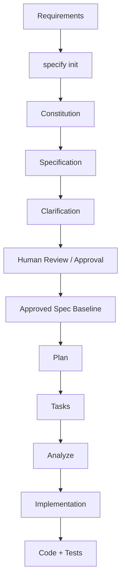

The important idea is that each stage produces a persistent engineering artifact.

---

## 4. Initialization

The official Spec Kit initialization is performed using the terminal command:

```bash
specify init
```

This initializes the project structure and prepares the environment for the Spec Kit workflow.

It creates the `.specify` area containing project memory, templates and supporting scripts.

> **Important:** `specify init` is the CLI initialization command. The `/speckit.*` commands are agent slash commands used during the development workflow.

---

## 5. Constitution: Establish the Engineering Principles

The first major artifact is the project constitution.

```text
.specify/
└── memory/
    └── constitution.md
```

The constitution defines project-wide principles and constraints.

For a Hospital ERP, this could include principles such as:

- Patient safety
- Security and privacy
- Role-based access control
- Auditability
- Data integrity
- Interoperability
- Reliability
- Performance
- Maintainability
- Human oversight for AI-generated decisions
- Traceability of requirements
- Controlled changes to approved requirements

The constitution answers:

> **"What principles must every feature follow?"**

For example:

```text
Patient data must only be accessible according to the user's
authorized role and permissions.

Clinical AI recommendations must not silently replace
clinician decisions.

Critical workflows must maintain an auditable history of
important actions and changes.
```

These principles can then influence every feature specification and implementation.

---

## 6. Specification: Define What Needs to Be Built

The `/speckit.specify` workflow converts requirements into a structured specification.

For example:

```text
specs/
└── 002-patient-registration/
    └── spec.md
```

The specification can contain:

- Problem statement
- User stories
- Functional requirements
- Non-functional requirements
- Acceptance criteria
- Business rules
- Validation rules
- Error scenarios
- Edge cases
- Dependencies

For example:

```markdown
## User Story

As a registration operator,
I want to register a new patient,
so that the patient can receive hospital services.

## Acceptance Criteria

- The system shall capture mandatory demographic information.
- The system shall validate required fields.
- The system shall prevent duplicate patient registration
  based on configured matching rules.
- The system shall generate a unique patient identifier.
- All registration actions shall be auditable.
```

The goal is to make the intended behavior explicit before implementation begins.

---

## 7. Clarification: Remove Ambiguity Before Coding

Requirements are rarely perfect on the first attempt.

This is where `/speckit.clarify` becomes useful.

Clarification should identify:

- Ambiguous requirements
- Missing business rules
- Conflicting assumptions
- Unclear workflows
- Missing edge cases
- Unspecified roles
- Unclear data behavior

For example:

> Should a patient with an existing record be allowed to create another registration?

That question sounds simple, but it can affect:

- Patient identity
- Medical history
- Billing
- Insurance
- Clinical records
- Reporting
- Compliance
- Duplicate data

AI should not silently guess.

The ambiguity should be surfaced and resolved.

---

## 8. Human-in-the-Loop: Product Owner Review

This is one of the most important governance points.

AI can generate a specification.

But AI should not be the final authority on whether the requirement is correct.

A recommended workflow is:

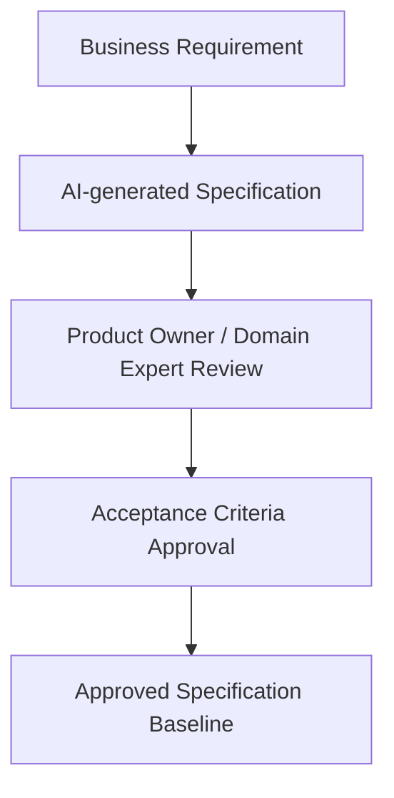

The Product Owner or appropriate domain expert validates:

- Business intent
- Workflow correctness
- Acceptance criteria
- Roles and permissions
- Business rules
- Regulatory considerations
- Clinical or operational implications

Only after this review should the specification become the baseline for implementation.

---

## 9. Freeze the Approved Specification Before Implementation

A useful enterprise governance practice is to **freeze the approved specification as the baseline for that implementation cycle**.

This is not an official Spec Kit command. It is a governance layer that can be applied around the Spec Kit workflow.

Why is this important?

Because an AI coding agent may encounter a gap during implementation.

Without a controlled baseline, there is a risk that the agent could modify the specification to make the implementation appear compliant.

The safer model is:

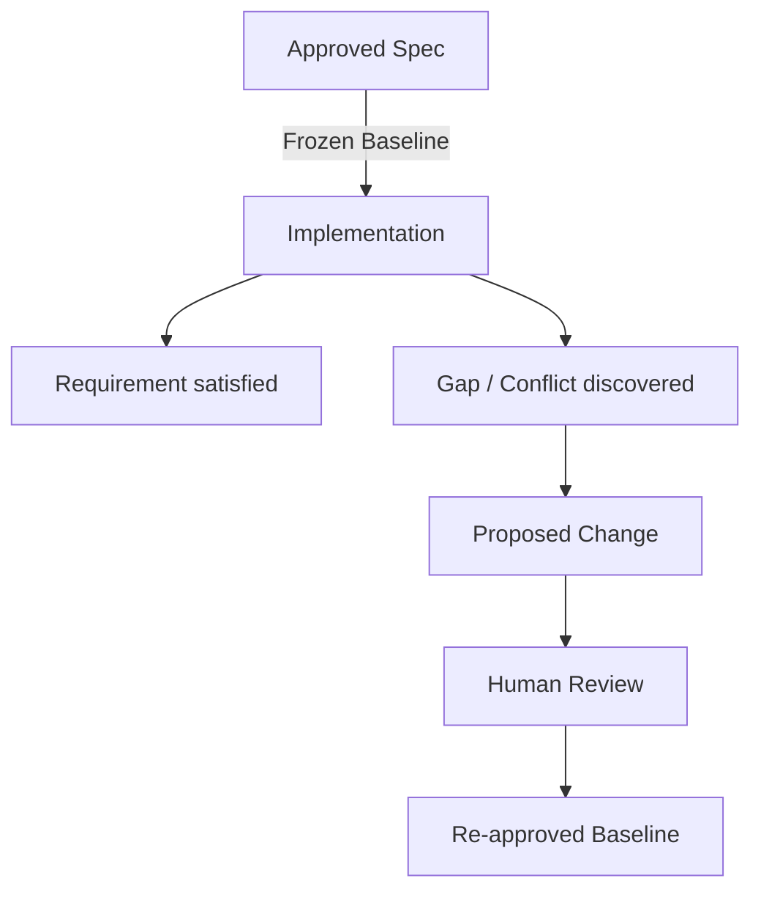

The key principle is:

> **If implementation discovers a requirement gap, flag it as a proposed change — do not silently rewrite the source of truth.**

This creates traceability.

---

## 10. Planning: Decide How It Will Be Built

Once the specification is approved, the next step is planning, using `/speckit.plan`.

The plan describes implementation decisions such as:

- Architecture
- Technology choices
- Data model
- APIs
- Contracts
- Integration points
- Security considerations
- Dependencies
- Technical constraints
- Research findings

For example, a patient registration feature may need to define:

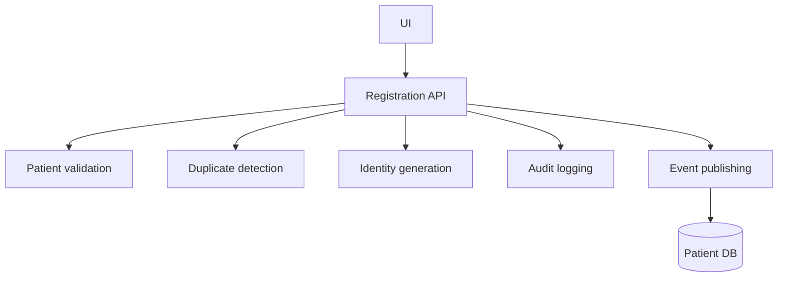

The plan answers:

> **"How should the approved requirement be implemented?"**

---

## 11. Tasks: Convert the Plan Into Executable Work

The next step is `/speckit.tasks`.

The plan is converted into actionable, ordered tasks.

For example:

1. Create patient registration database model
2. Implement patient validation service
3. Implement duplicate detection
4. Create registration API
5. Implement registration UI
6. Add audit logging
7. Add authorization checks
8. Add unit tests
9. Add integration tests
10. Validate acceptance criteria

Good tasks should be:

- Actionable
- Testable
- Ordered
- Traceable to requirements
- Small enough for reliable implementation

---

## 12. Analyze: Check for Drift Before Implementation

Before implementation, the workflow can use `/speckit.analyze`.

The purpose is to identify inconsistencies or drift across the engineering artifacts.

Conceptually:

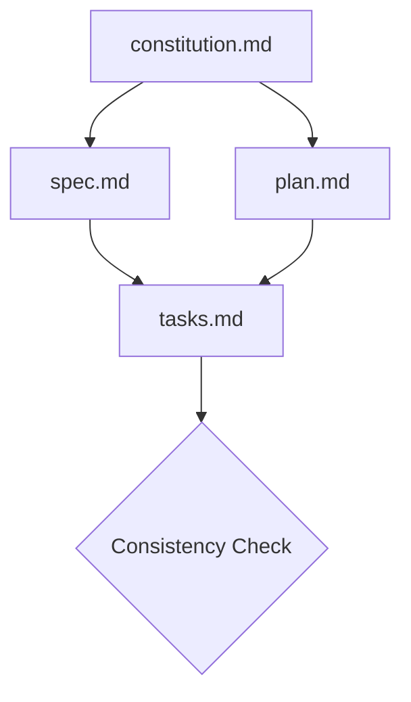

Questions include:

- Does the plan satisfy the specification?
- Do tasks cover the planned work?
- Are requirements missing from the implementation plan?
- Are there contradictions?
- Are constitutional principles being respected?

The analyze stage helps catch problems before code is generated.

---

## 13. Implementation

Only after the specification, plan and tasks are aligned should implementation begin, using `/speckit.implement`.

The AI coding agent can then work from the approved artifacts.

The output includes:

- Source code
- Tests
- Supporting implementation artifacts

The desired relationship is:

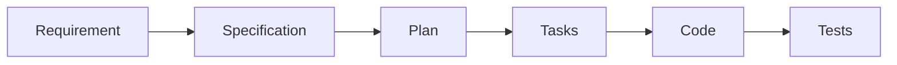

This creates a traceable development chain.

---

## 14. Hospital ERP Repository Structure

A Hospital ERP can be organized around feature-level specifications.

```text
hospital-erp/
│
├── .specify/
│   ├── memory/
│   │   └── constitution.md
│   ├── templates/
│   └── scripts/
│
├── specs/
│   ├── 001-authentication/
│   ├── 002-patient-registration/
│   ├── 003-appointment/
│   ├── 004-emergency/
│   ├── 005-ipd/
│   ├── 006-opd/
│   ├── 007-doctor-workflow/
│   ├── 008-nursing/
│   ├── 009-soap-voice-capture/
│   ├── 010-laboratory/
│   ├── 011-radiology/
│   ├── 012-pharmacy/
│   ├── 013-inventory/
│   ├── 014-billing/
│   ├── 015-insurance/
│   ├── 016-gst-tax/
│   ├── 017-hr/
│   ├── 018-ai-rag/
│   ├── 019-ai-agents/
│   ├── 020-ai-chatbot/
│   └── 021-analytics/
│
├── src/
├── tests/
└── docs/
```

Each major capability can have its own `spec.md`, `plan.md`, `tasks.md`, implementation and tests.

This makes the repository more than a codebase.

It becomes a **living engineering knowledge base**.

---

## 15. Why Feature-Level Specifications Matter in a Hospital ERP

Hospital workflows are highly interconnected.

For example:

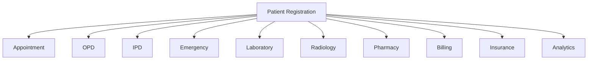

A change to patient identity can potentially affect many downstream systems.

Therefore, requirements need to be traceable.

A feature specification can answer:

- What changed?
- Why did it change?
- Which workflow is affected?
- Which APIs are affected?
- Which data model is affected?
- Which tests need updating?
- Which other features depend on it?

This is especially important for enterprise healthcare software.

---

## 16. AI Agents Should Also Be Specified

AI agents should not simply be added because:

> "AI can do this."

Each agent should have a clear purpose and boundary.

For example:

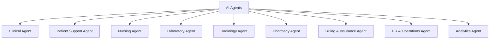

Each agent should have a specification defining:

- Purpose
- Users
- Inputs
- Outputs
- Tools
- Data sources
- Permissions
- Escalation rules
- Human approval requirements
- Failure behavior
- Audit requirements
- Security constraints

The question should not be:

> "Where can we add AI?"

Instead:

> **"Which workflow problem should this agent solve, and what boundaries must it operate within?"**

---

## 17. RAG for the Hospital

A hospital-wide RAG system can provide grounded access to organizational knowledge.

Potential knowledge sources include:

- Policies
- SOPs
- Clinical guidelines
- Department procedures
- HR policies
- Billing rules
- Insurance documentation
- Training materials
- Hospital-specific operational documentation

A RAG specification should define:

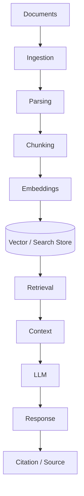

Important requirements include:

- Access control
- Document versioning
- Source attribution
- Data freshness
- Retrieval quality
- Auditability
- Human escalation
- Protection of sensitive information

---

## 18. Voice-to-Text and SOAP Capture

Another important healthcare AI workflow is voice-enabled clinical documentation.

For example:

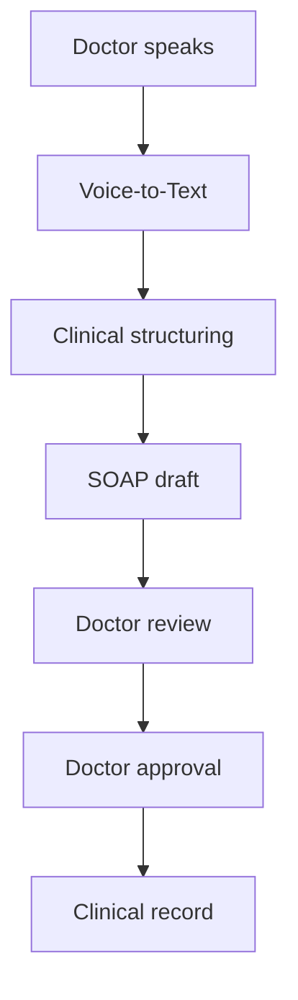

The important principle is:

> **AI should assist documentation; the authorized clinician remains responsible for reviewing and approving the final clinical record.**

The specification should define:

- Recording behavior
- Transcription
- Speaker handling
- Medical terminology
- Error handling
- Editing
- Review
- Approval
- Audit trail
- Data retention
- Access control

---

## 19. Claude Code, Codex, Cursor and Spec Kit

Modern development can combine multiple AI coding environments with Spec Kit.

For example:

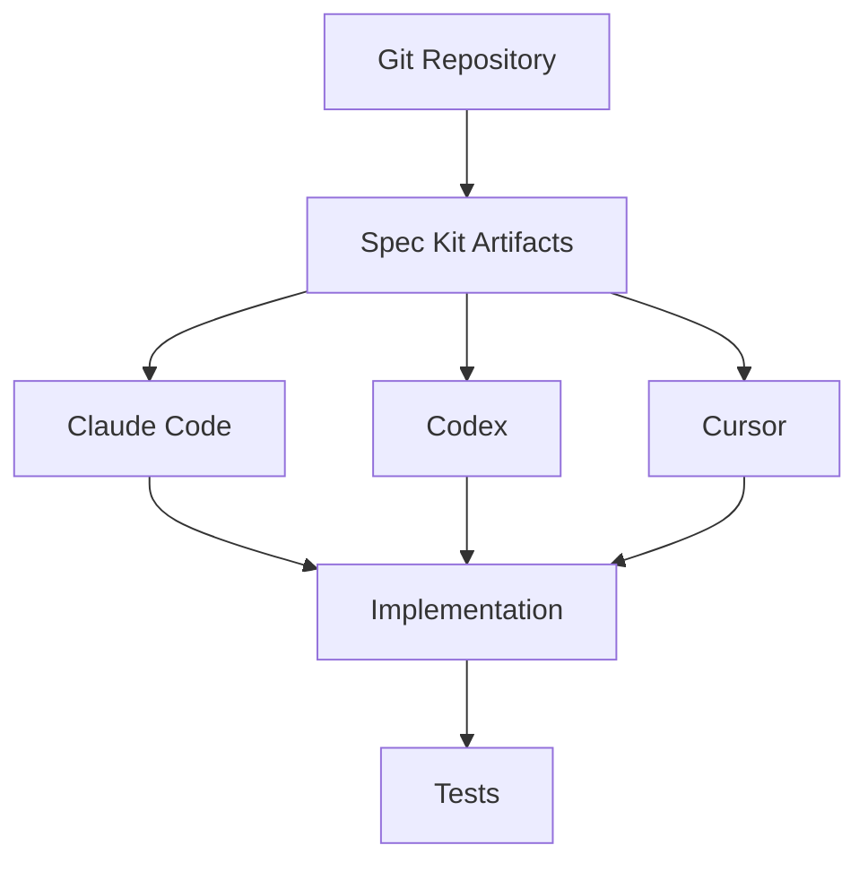

The tools may differ, but the source of truth remains the engineering artifacts.

This creates an important separation:

> **The AI tool can change. The specification and governance model should remain stable.**

---

## 20. Git Provides Traceability

Because the artifacts are Markdown files stored in Git, changes can be tracked.

For example:

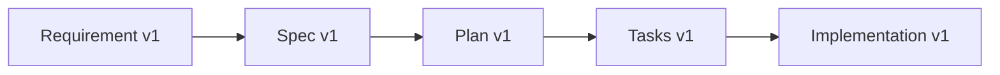

If a requirement changes:

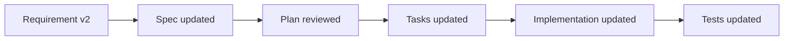

This creates a much clearer change history.

---

## 21. Requirements Will Change — and That Is Normal

A frozen baseline does not mean requirements can never change.

Healthcare systems evolve because of:

- Business changes
- Regulatory changes
- Operational feedback
- New integrations
- User feedback
- Security requirements
- New technology
- Clinical workflow changes

The correct approach is controlled change.

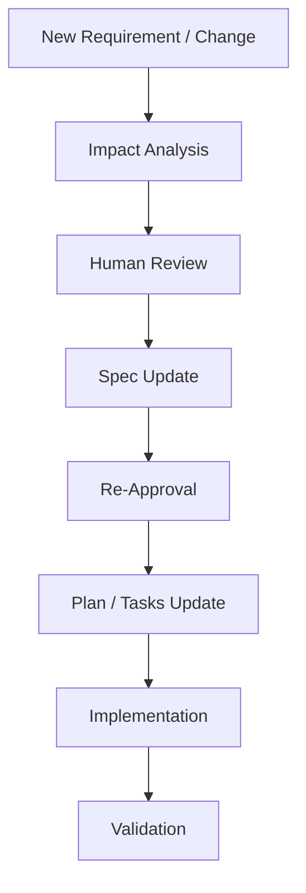

The principle is:

> **Change deliberately, not silently.**

---

## 22. Human-in-the-Loop Is Not a Bottleneck

Human review is sometimes described as slowing AI development.

I see it differently.

In high-impact systems, human review is a quality and governance mechanism.

AI can help with:

- Requirement analysis
- Specification drafting
- Architecture proposals
- Code generation
- Test generation
- Documentation
- Consistency analysis

Humans remain responsible for:

- Business decisions
- Product decisions
- Clinical decisions
- Risk acceptance
- Security approval
- Compliance
- Final requirement approval

The goal is not to remove humans.

The goal is to make humans **more effective**.

---

## 23. A More Mature Development Loop

The resulting development model looks like:

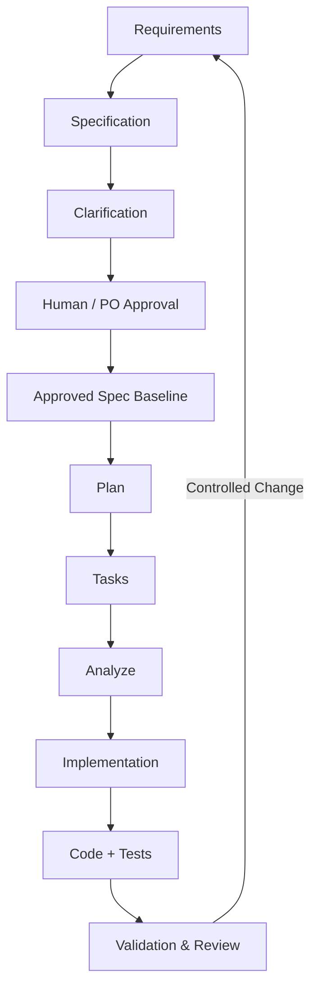

This is more than an AI coding workflow.

It is an **engineering governance model for AI-assisted development**.

---

## 24. The Bigger Idea

The real opportunity with AI-assisted software development is not simply generating code faster.

It is creating a stronger connection between business intent and everything downstream of it — requirements, specification, architecture, tasks, implementation, testing and validation.

When these artifacts are connected and version controlled, AI agents become much more useful.

They are no longer operating from a vague prompt.

They are operating within a defined engineering system.

---

## 25. Final Takeaway

For a Hospital ERP, the combination of:

- Spec-Driven Development
- GitHub Spec Kit
- AI coding agents
- Persistent Markdown artifacts
- Git version control
- Human-in-the-loop review
- Approved specification baselines
- Automated consistency analysis
- Automated implementation and testing
- Healthcare-specific governance

can create a much more disciplined way of building complex software.

The goal is not:

> **AI replaces software engineering.**

The goal is:

> **AI accelerates software engineering while humans retain control over intent, decisions, quality and accountability.**

And for healthcare, that distinction matters.

---

## Clear Specs. Smarter Development. Better Healthcare.

**Joe Nishanth**
*AI Agents Developer*
*Healthcare | AI | Automation | Real Impact*

---

## References

- [Examine GitHub Spec Kit commands and results](https://learn.microsoft.com/en-us/training/modules/spec-driven-development-github-spec-kit-greenfield-intro/8-examine-github-spec-kit-commands-results?pivots=video) — Microsoft Learn documentation covering Spec Kit commands, workflow stages and generated artifacts.
- [Explore GitHub Spec Kit workflows and optional commands](https://learn.microsoft.com/en-us/training/modules/spec-driven-development-github-spec-kit-enterprise-developers/3-examine-github-spec-kit) — Microsoft Learn material covering Spec Kit workflows and optional commands.
- [Diving Into Spec-Driven Development With GitHub Spec Kit](https://developer.microsoft.com/blog/spec-driven-development-spec-kit/) — Microsoft's overview of Spec-Driven Development and GitHub Spec Kit.
