## 1. The Problem: AI Can Write Code — But Does It Know What Should Be Built?

AI coding agents can generate software remarkably fast.

But speed alone does not solve the hardest engineering problem:

> **Are we building the right thing?**

A Hospital ERP is not a simple application. It is a federation of clinical, diagnostic, operational and financial workflows that share one patient identity and must stay consistent with each other.

### The domain landscape

Grouping the scope by concern makes the coupling visible. Every branch below ultimately hangs off the same patient record.

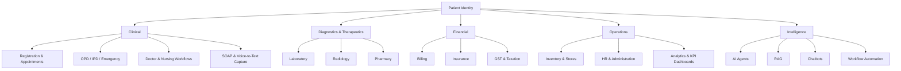

*Figure 1 — Hospital ERP domain landscape. Five concern areas, all anchored to a single patient identity.*

### One patient, many modules

The modules are not independent products. A single outpatient visit crosses most of them in sequence, and each arrow below is a handoff where data, permissions and state must line up.

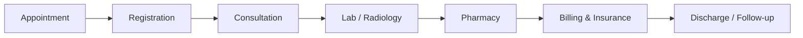

*Figure 2 — A typical outpatient journey. Each handoff is a contract between two modules.*

If the consultation module and the billing module disagree about what "visit closed" means, the defect does not appear in either module's own tests. It appears at the seam between them — which is exactly the kind of agreement a specification is good at pinning down.

When AI agents are involved, the need for clear requirements becomes even more important.

The challenge is therefore not simply:

> **"How can AI write more code?"**

It is:

> **"How can we give AI precise intent, constraints, context and acceptance criteria so that the generated software remains aligned with the business requirement?"**

This is where **Spec-Driven Development (SDD)** becomes valuable.

### Why prompt-driven development struggles here

Prompting an agent directly is effective for small, self-contained changes. It weakens as a system grows, because the intent behind the code lives in a conversation that is not versioned, not reviewable and usually not retained.

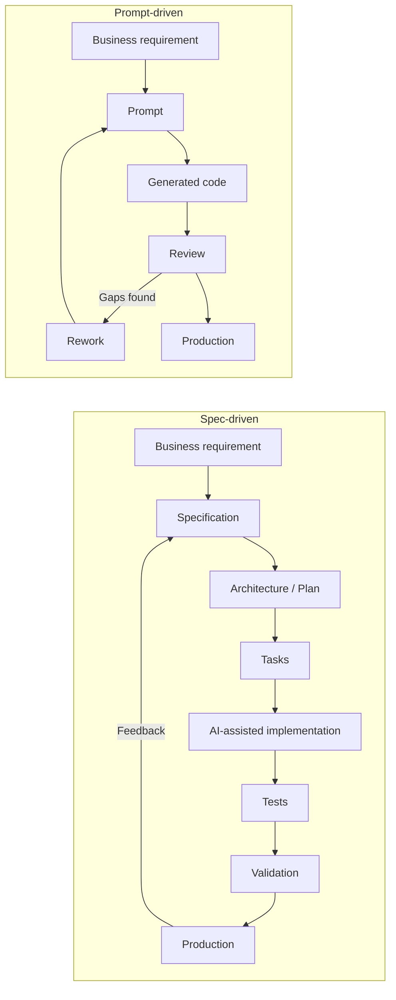

*Figure 3 — The same requirement through both models. In the upper loop, intent is consumed and discarded; in the lower one, it is captured in an artifact that outlives the change.*

The difference is not that one uses AI and the other does not. Both use AI. The difference is where the intent is stored.

| Concern | Prompt-driven | Spec-driven |
|---|---|---|
| Source of intent | The prompt, discarded after use | A versioned specification |
| Ambiguity | Resolved silently by the model | Surfaced and decided by a human |
| First review target | Generated code | The specification, then the code |
| Handling change | Another prompt | A specification update with impact analysis |
| Traceability | Chat history, if retained at all | Git history across spec, plan, tasks and tests |
| Regression risk | Earlier decisions may be forgotten | Earlier decisions remain readable in the artifact |

> **Key insight**
>
> Prompting and specifying both use AI. What differs is whether the reasoning behind a decision survives the change that implemented it.
{: .callout .callout--insight}

---

## 2. Specification Should Be an Engineering Artifact

In traditional development, requirements can easily become scattered across:

- Meetings
- Emails
- Documents
- Tickets
- Conversations
- Developer assumptions

With AI-assisted development, that becomes risky.

An AI agent needs a persistent source of truth that it can repeatedly reference.

That source can be a version-controlled specification.

A specification should describe:

- What needs to be built
- Why it is needed
- Who uses it
- Expected behavior
- Acceptance criteria
- Functional requirements
- Non-functional requirements
- Edge cases
- Constraints
- Dependencies

Once that artifact exists, it stops being a document that is read once and starts being the thing everything else is derived from and checked against.

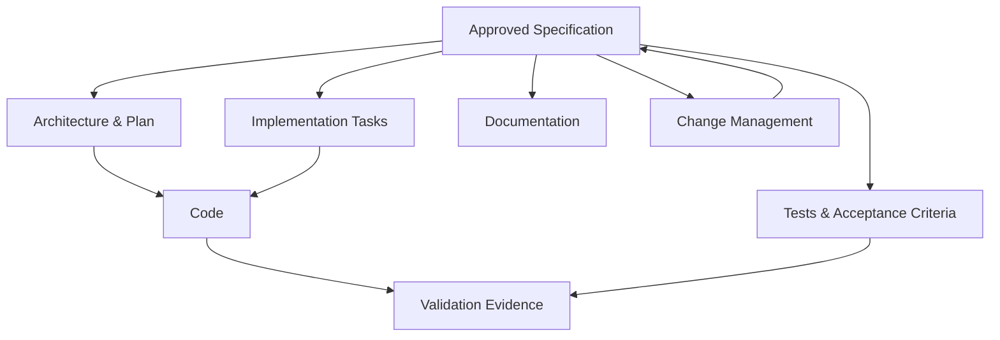

*Figure 4 — The specification as source of truth. Derived artifacts flow outward; changes flow back through it rather than around it.*

The important shift is:

> **The specification is not just documentation. It becomes part of the engineering workflow.**

A practical consequence worth stating early: if a coding agent needs a decision that the specification does not contain, that is a gap in the specification, not a detail for the agent to settle on its own.

---

## 3. GitHub Spec Kit and the Spec-Driven Workflow

GitHub Spec Kit provides a structured workflow for turning requirements into implementation.

The overall flow can be represented as:


*Figure 5 — The Spec Kit workflow in three phases. Rectangles are artifacts that persist in Git, rounded boxes are commands or activities, diamonds are decisions.*

Three edges in that diagram matter as much as the forward path. Review can send a specification back for changes. Analysis can send drift back to the plan before any code is generated. And a gap discovered during implementation returns to review rather than being settled in place — the rule section 9 sets out in detail.

The important idea is that each stage produces a persistent engineering artifact.

---

## 4. Initialization

The official Spec Kit initialization is performed using the terminal command:

```bash
specify init
```

This initializes the project structure and prepares the environment for the Spec Kit workflow.

It creates the `.specify` area containing project memory, templates and supporting scripts.

> **Important:** `specify init` is the CLI initialization command. The `/speckit.*` commands are agent slash commands used during the development workflow.

---

## 5. Constitution: Establish the Engineering Principles

The first major artifact is the project constitution.

```text
.specify/
└── memory/
    └── constitution.md
```

The constitution defines project-wide principles and constraints.

For a Hospital ERP, this could include principles such as:

- Patient safety
- Security and privacy
- Role-based access control
- Auditability
- Data integrity
- Interoperability
- Reliability
- Performance
- Maintainability
- Human oversight for AI-generated decisions
- Traceability of requirements
- Controlled changes to approved requirements

The constitution answers:

> **"What principles must every feature follow?"**

For example:

```text
Patient data must only be accessible according to the user's
authorized role and permissions.

Clinical AI recommendations must not silently replace
clinician decisions.

Critical workflows must maintain an auditable history of
important actions and changes.
```

These principles can then influence every feature specification and implementation.

---

## 6. Specification: Define What Needs to Be Built

The `/speckit.specify` workflow converts requirements into a structured specification.

For example:

```text
specs/
└── 002-patient-registration/
    └── spec.md
```

The specification can contain:

- Problem statement
- User stories
- Functional requirements
- Non-functional requirements
- Acceptance criteria
- Business rules
- Validation rules
- Error scenarios
- Edge cases
- Dependencies

For example:

```markdown
## User Story

As a registration operator,
I want to register a new patient,
so that the patient can receive hospital services.

## Acceptance Criteria

- The system shall capture mandatory demographic information.
- The system shall validate required fields.
- The system shall prevent duplicate patient registration
  based on configured matching rules.
- The system shall generate a unique patient identifier.
- All registration actions shall be auditable.
```

The goal is to make the intended behavior explicit before implementation begins.

---

## 7. Clarification: Remove Ambiguity Before Coding

Requirements are rarely perfect on the first attempt.

This is where `/speckit.clarify` becomes useful.

Clarification should identify:

- Ambiguous requirements
- Missing business rules
- Conflicting assumptions
- Unclear workflows
- Missing edge cases
- Unspecified roles
- Unclear data behavior

For example:

> Should a patient with an existing record be allowed to create another registration?

That question sounds simple, but it can affect:

- Patient identity
- Medical history
- Billing
- Insurance
- Clinical records
- Reporting
- Compliance
- Duplicate data

AI should not silently guess.

The ambiguity should be surfaced and resolved.

---

## 8. Human-in-the-Loop: Product Owner Review

This is one of the most important governance points.

AI can generate a specification.

But AI should not be the final authority on whether the requirement is correct.

A recommended workflow is:

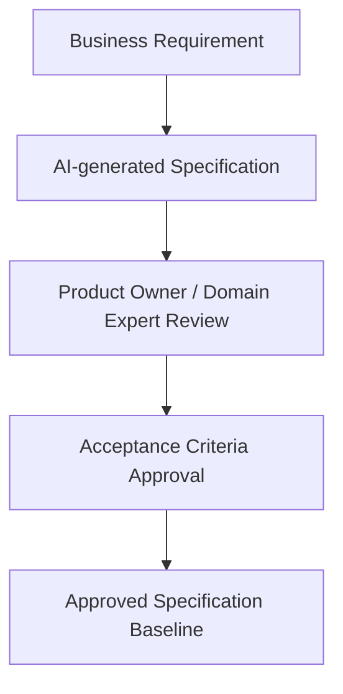

*Figure 6 — Specification approval. AI may draft it; a domain expert decides what becomes the baseline.*

The Product Owner or appropriate domain expert validates:

- Business intent
- Workflow correctness
- Acceptance criteria
- Roles and permissions
- Business rules
- Regulatory considerations
- Clinical or operational implications

Only after this review should the specification become the baseline for implementation.

---

## 9. Freeze the Approved Specification Before Implementation

A useful enterprise governance practice is to **freeze the approved specification as the baseline for that implementation cycle**.

This is not an official Spec Kit command. It is a governance layer that can be applied around the Spec Kit workflow.

Why is this important?

Because an AI coding agent may encounter a gap during implementation.

Without a controlled baseline, there is a risk that the agent could modify the specification to make the implementation appear compliant.

The safer model is:

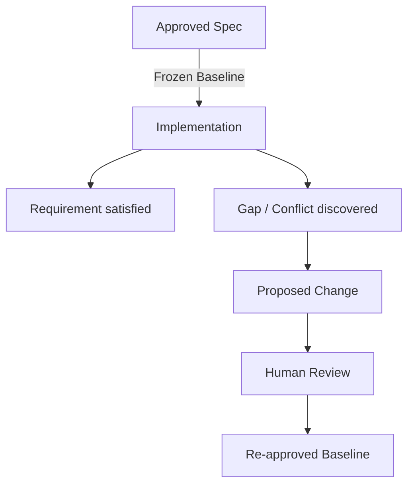

*Figure 7 — A gap discovered during implementation. The baseline moves only through review, never silently.*

The key principle is:

> **If implementation discovers a requirement gap, flag it as a proposed change — do not silently rewrite the source of truth.**

This creates traceability.

---

## 10. Planning: Decide How It Will Be Built

Once the specification is approved, the next step is planning, using `/speckit.plan`.

The plan describes implementation decisions such as:

- Architecture
- Technology choices
- Data model
- APIs
- Contracts
- Integration points
- Security considerations
- Dependencies
- Technical constraints
- Research findings

For example, a patient registration feature may need to define:

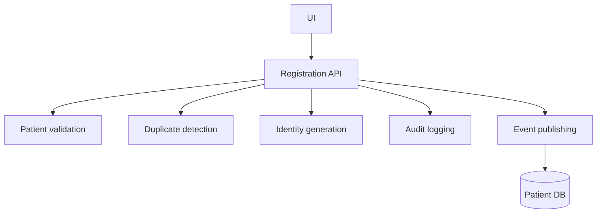

*Figure 8 — Components named by the plan for patient registration.*

The plan answers:

> **"How should the approved requirement be implemented?"**

---

## 11. Tasks: Convert the Plan Into Executable Work

The next step is `/speckit.tasks`.

The plan is converted into actionable, ordered tasks.

For example:

1. Create patient registration database model
2. Implement patient validation service
3. Implement duplicate detection
4. Create registration API
5. Implement registration UI
6. Add audit logging
7. Add authorization checks
8. Add unit tests
9. Add integration tests
10. Validate acceptance criteria

Good tasks should be:

- Actionable
- Testable
- Ordered
- Traceable to requirements
- Small enough for reliable implementation

---

## 12. Analyze: Check for Drift Before Implementation

Before implementation, the workflow can use `/speckit.analyze`.

The purpose is to identify inconsistencies or drift across the engineering artifacts.

Conceptually:

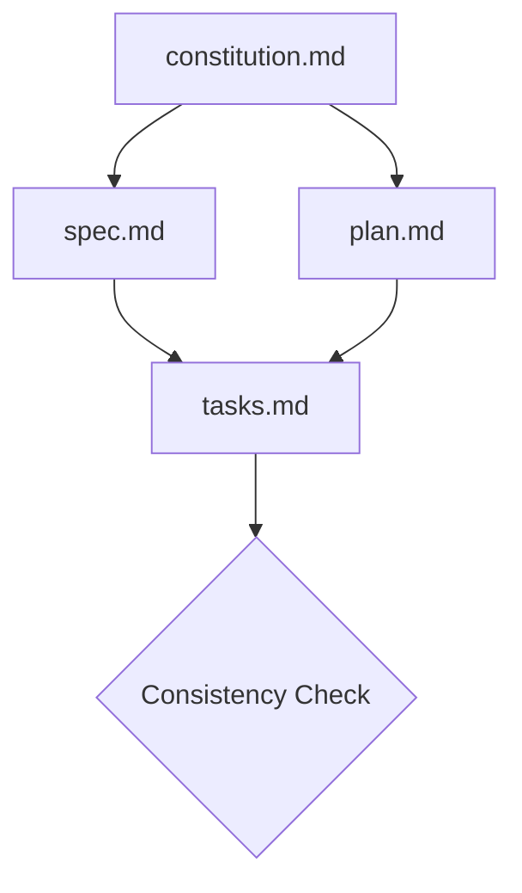

*Figure 9 — Cross-checking constitution, specification, plan and tasks before any code is generated.*

Questions include:

- Does the plan satisfy the specification?
- Do tasks cover the planned work?
- Are requirements missing from the implementation plan?
- Are there contradictions?
- Are constitutional principles being respected?

The analyze stage helps catch problems before code is generated.

---

## 13. Implementation

Only after the specification, plan and tasks are aligned should implementation begin, using `/speckit.implement`.

The AI coding agent can then work from the approved artifacts.

The output includes:

- Source code
- Tests
- Supporting implementation artifacts

The desired relationship is a single traceable chain: requirement, specification, plan, tasks, code, tests. The next section follows one real requirement along the whole of that chain.

---

## 14. Worked Example: Cancelling an Appointment

The workflow above is easier to judge against a single small requirement carried end to end. The example below is illustrative — it is not a statement of any hospital's actual policy.

### Business intent

> A patient should be able to cancel a scheduled appointment themselves, up to a configured cut-off before the appointment time.

Stated that way, the requirement still hides at least four decisions: who else may cancel, what happens to a slot that is released, what the patient is told, and what the hospital must be able to prove afterwards.

### Specification

The specification is where those decisions get made — before any code exists.

```markdown
# REQ-APPT-014 — Patient-initiated appointment cancellation

## User story
As a registered patient,
I want to cancel a scheduled appointment before the cancellation deadline,
so that I do not occupy a slot I cannot attend.

## Acceptance criteria
- AC-1  A patient may cancel only their own appointment, and only while
        its status is `Scheduled`.
- AC-2  Cancellation is permitted until the configured cut-off before the
        appointment start time. The cut-off is configurable per department.
- AC-3  After the cut-off, the patient-initiated cancellation is rejected
        and the patient is directed to contact the hospital.
- AC-4  A successful cancellation releases the slot for rebooking.
- AC-5  The patient receives a cancellation confirmation.

## Business rules
- BR-1  An appointment already marked `CheckedIn`, `Completed` or
        `Cancelled` cannot be cancelled again.
- BR-2  Releasing a slot must not overwrite a booking made in the interim.

## Security constraints
- SC-1  The caller must be authenticated and authorised for the patient
        record referenced by the appointment.
- SC-2  Every cancellation attempt, successful or rejected, is recorded in
        the audit log with actor, timestamp, appointment and outcome.

## Non-functional requirements
- NFR-1 Slot release and appointment status change are applied atomically.
- NFR-2 Confirmation delivery failure must not roll back the cancellation.

## Edge cases
- Concurrent cancellation and reschedule of the same appointment.
- Cancellation attempted exactly at the cut-off boundary.
- Notification channel unavailable.

## Dependencies
- Scheduling (slot inventory), Notifications, Audit, Identity.
```

Two things in that specification are worth noticing. NFR-2 encodes a deliberate trade-off — a failed SMS must not silently undo a cancellation the patient believes succeeded. And SC-2 requires that *rejected* attempts are logged too, which is the kind of requirement that is almost never inferred from a prompt but matters a great deal when someone later asks why a patient was marked absent.

### Design

The plan names the components the change touches, which also defines its blast radius.

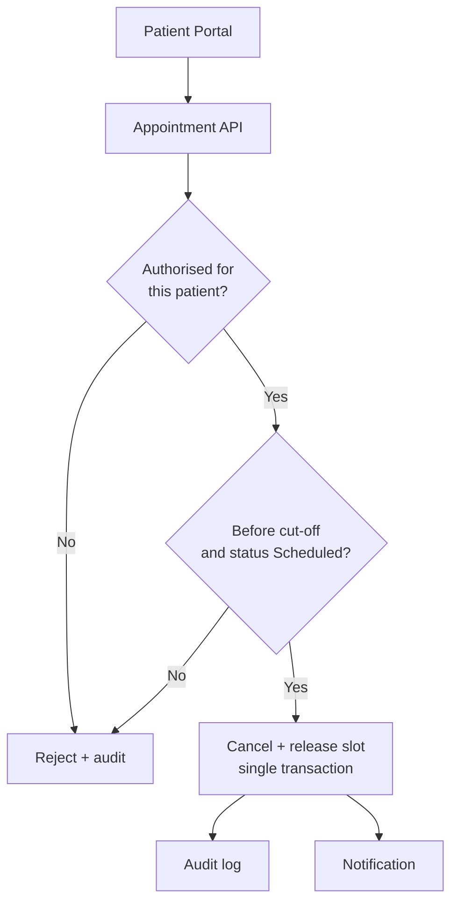

*Figure 10 — Components touched by REQ-APPT-014. Both rejection paths still reach the audit log, as SC-2 requires.*

### Tasks

The plan becomes ordered, individually testable units of work:

| Task | Description | Covers |
|---|---|---|
| T-41 | Add `Cancelled` transition and guard to the appointment state model | AC-1, BR-1 |
| T-42 | Implement per-department cut-off configuration and evaluation | AC-2, AC-3 |
| T-43 | Release slot and update status in one transaction | AC-4, BR-2, NFR-1 |
| T-44 | Emit audit entries for accepted and rejected attempts | SC-2 |
| T-45 | Dispatch confirmation asynchronously | AC-5, NFR-2 |
| T-46 | Authorisation check on the patient record | SC-1 |

### Tests

Acceptance criteria map to named cases, including the ones that must fail:

```text
TC-APPT-014-a  Cancel own Scheduled appointment before cut-off  -> accepted
TC-APPT-014-b  Cancel after cut-off                             -> rejected, audited
TC-APPT-014-c  Cancel another patient's appointment             -> rejected, audited
TC-APPT-014-d  Cancel an already Cancelled appointment          -> rejected
TC-APPT-014-e  Notification provider unavailable                -> cancellation stands
TC-APPT-014-f  Concurrent cancel and reschedule                 -> slot not double-booked
```

Cases b, c and e are the interesting ones. Each corresponds to a line in the specification that a reasonable developer — or a reasonable coding agent — could otherwise have implemented the other way round.

### Traceability

Because every artifact carries an identifier, the chain can be read in either direction: forwards from intent to evidence, or backwards from a line of code to the decision that justifies it.

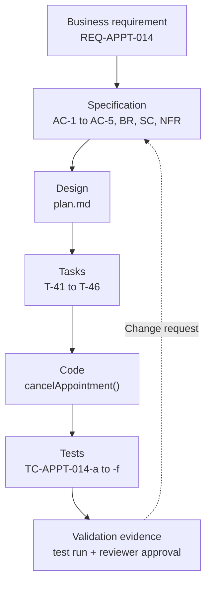

*Figure 11 — Traceability for one requirement. The dotted return path is the only sanctioned route for changing it.*

This is what makes the question "why does the code do that?" answerable months later, by someone who was not in the room.

> **Practical rule**
>
> If a requirement changes, update the specification first — then propagate the change through design, tasks, implementation and tests. A change that enters through the code leaves no trace of why it was made.
{: .callout .callout--rule}

---

## 15. Hospital ERP Repository Structure

A Hospital ERP can be organized around feature-level specifications.

```text
hospital-erp/
│
├── .specify/
│   ├── memory/
│   │   └── constitution.md
│   ├── templates/
│   └── scripts/
│
├── specs/
│   ├── 001-authentication/
│   ├── 002-patient-registration/
│   ├── 003-appointment/
│   ├── 004-emergency/
│   ├── 005-ipd/
│   ├── 006-opd/
│   ├── 007-doctor-workflow/
│   ├── 008-nursing/
│   ├── 009-soap-voice-capture/
│   ├── 010-laboratory/
│   ├── 011-radiology/
│   ├── 012-pharmacy/
│   ├── 013-inventory/
│   ├── 014-billing/
│   ├── 015-insurance/
│   ├── 016-gst-tax/
│   ├── 017-hr/
│   ├── 018-ai-rag/
│   ├── 019-ai-agents/
│   ├── 020-ai-chatbot/
│   └── 021-analytics/
│
├── src/
├── tests/
└── docs/
```

Each major capability can have its own `spec.md`, `plan.md`, `tasks.md`, implementation and tests.

This makes the repository more than a codebase.

It becomes a **living engineering knowledge base**.

---

## 16. Why Feature-Level Specifications Matter in a Hospital ERP

Hospital workflows are highly interconnected. Figure 1 showed every domain hanging off a single patient identity, and Figure 2 showed one visit crossing most of them in sequence.

The consequence is that a change to patient identity — a new matching rule, a changed identifier format, a merge of duplicate records — can reach registration, appointments, clinical records, diagnostics, billing, insurance and analytics at once.

Therefore, requirements need to be traceable.

A feature specification can answer:

- What changed?
- Why did it change?
- Which workflow is affected?
- Which APIs are affected?
- Which data model is affected?
- Which tests need updating?
- Which other features depend on it?

This is especially important for enterprise healthcare software.

---

## 17. AI Agents Should Also Be Specified

AI agents should not simply be added because:

> "AI can do this."

Each agent should have a clear purpose and boundary.

For example:

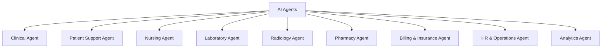

*Figure 12 — Agents as specified components, each with its own purpose, permissions and escalation rules.*

Each agent should have a specification defining:

- Purpose
- Users
- Inputs
- Outputs
- Tools
- Data sources
- Permissions
- Escalation rules
- Human approval requirements
- Failure behavior
- Audit requirements
- Security constraints

The question should not be:

> "Where can we add AI?"

Instead:

> **"Which workflow problem should this agent solve, and what boundaries must it operate within?"**

---

## 18. RAG for the Hospital

A hospital-wide RAG system can provide grounded access to organizational knowledge.

Potential knowledge sources include:

- Policies
- SOPs
- Clinical guidelines
- Department procedures
- HR policies
- Billing rules
- Insurance documentation
- Training materials
- Hospital-specific operational documentation

A RAG specification should define:

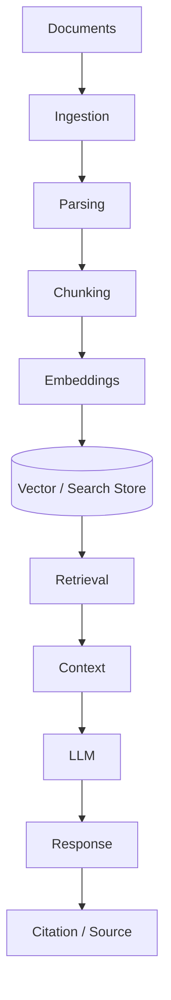

*Figure 13 — A hospital RAG pipeline. Access control and source attribution are requirements, not later additions.*

Important requirements include:

- Access control
- Document versioning
- Source attribution
- Data freshness
- Retrieval quality
- Auditability
- Human escalation
- Protection of sensitive information

---

## 19. Voice-to-Text and SOAP Capture

Another important healthcare AI workflow is voice-enabled clinical documentation.

For example:

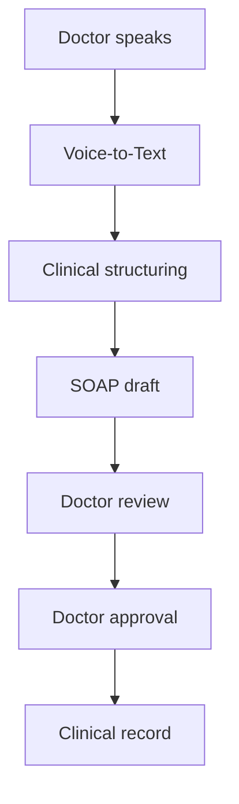

*Figure 14 — Voice-captured SOAP documentation. Nothing reaches the clinical record without clinician approval.*

The important principle is:

> **AI should assist documentation; the authorized clinician remains responsible for reviewing and approving the final clinical record.**

The specification should define:

- Recording behavior
- Transcription
- Speaker handling
- Medical terminology
- Error handling
- Editing
- Review
- Approval
- Audit trail
- Data retention
- Access control

---

## 20. Claude Code, Codex, Cursor and Spec Kit

Modern development can combine multiple AI coding environments with Spec Kit.

For example:

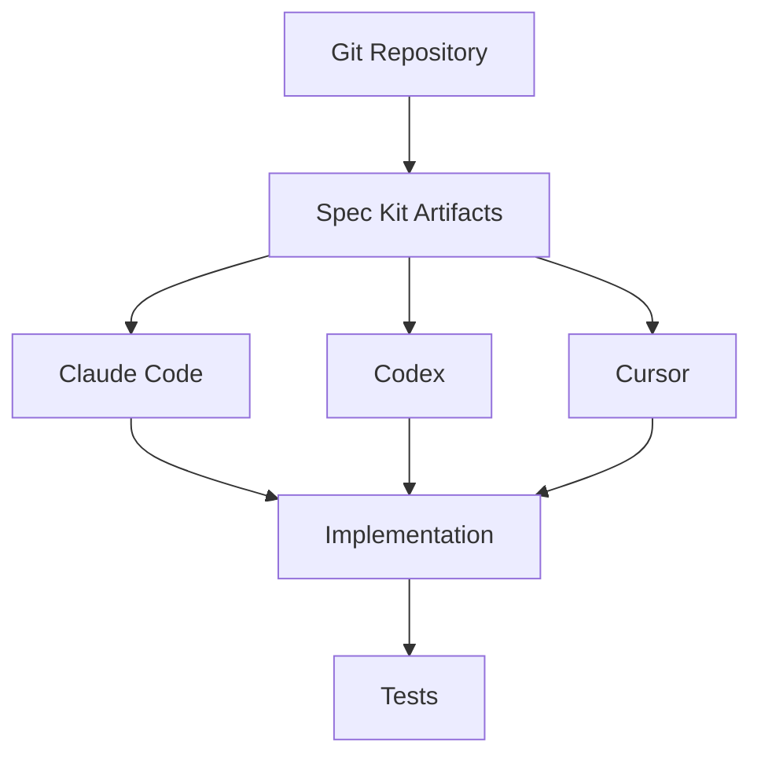

*Figure 15 — The coding environment varies; the artifacts it works from do not.*

The tools may differ, but the source of truth remains the engineering artifacts.

This creates an important separation:

> **The AI tool can change. The specification and governance model should remain stable.**

---

## 21. Git Provides Traceability

Because the artifacts are Markdown files stored in Git, a requirement change is a reviewable diff rather than a recollection.

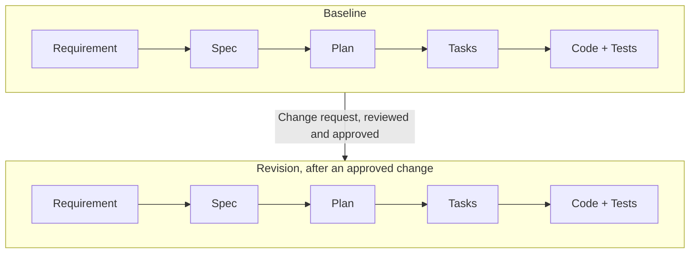

*Figure 16 — The same chain across two revisions. The diff shows not only what changed in the code, but which requirement authorised it.*

This creates a much clearer change history. The practical benefit is that a reviewer can ask "which requirement does this commit serve?" and get an answer from the repository rather than from memory.

---

## 22. Requirements Will Change — and That Is Normal

A frozen baseline does not mean requirements can never change.

Healthcare systems evolve because of:

- Business changes
- Regulatory changes
- Operational feedback
- New integrations
- User feedback
- Security requirements
- New technology
- Clinical workflow changes

The correct approach is controlled change.

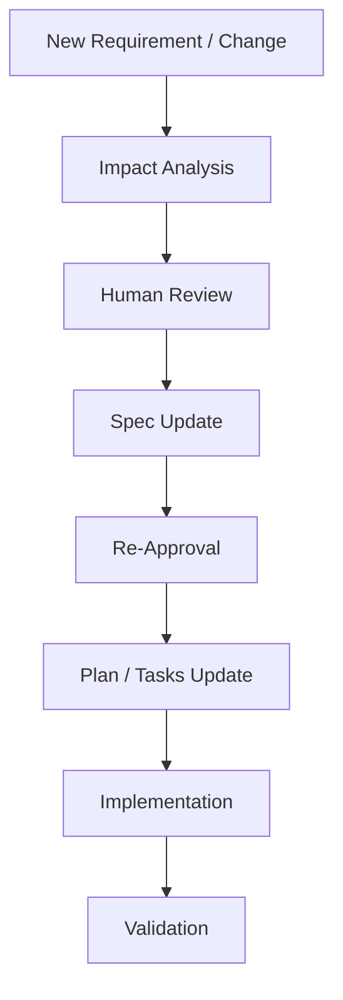

*Figure 17 — Controlled change. Impact analysis and re-approval come before implementation.*

The principle is:

> **Change deliberately, not silently.**

---

## 23. Human-in-the-Loop Is Not a Bottleneck

Human review is sometimes described as slowing AI development.

I see it differently.

In high-impact systems, human review is a quality and governance mechanism.

Splitting the work by who is accountable — rather than by who is faster — makes the boundaries concrete:

| Activity | Human | AI assistance | Automated validation |
|---|---|---|---|
| Requirement analysis | Decides | Drafts, surfaces ambiguity | — |
| Specification approval | Approves the baseline | Drafts, proposes criteria | Consistency checks across artifacts |
| Architecture | Decides | Proposes options, trade-offs | — |
| Implementation | Reviews | Generates code | Build, lint, type checks |
| Tests | Defines intent and coverage | Generates cases | Executes on every change |
| Clinical and safety decisions | Owns | Not delegated | — |
| Security approval | Owns | Flags candidate issues | Scanning, policy checks |
| Risk acceptance and compliance | Owns | Not delegated | — |

The rows with no AI column are the point. They are not tasks that a better model eventually absorbs; they are decisions that require someone accountable for the outcome.

> **Healthcare principle**
>
> AI can assist with drafting, implementation and analysis. Responsibility for clinical intent, safety requirements, security and governance remains with qualified people and organisational process.
{: .callout .callout--principle}

The goal is not to remove humans.

The goal is to make humans **more effective**.

---

## 24. A More Mature Development Loop

The resulting development model is the loop this article has traced. Requirements become a specification. Clarification and human approval turn that specification into a baseline. Plan and tasks derive from the baseline, analysis checks them against it, implementation produces code and tests, and validation closes the loop. When something has to change, it re-enters through the specification rather than around it.

This is more than an AI coding workflow.

It is an **engineering governance model for AI-assisted development**.

---

## 25. Healthcare Concerns the Specification Has to Carry

General-purpose specifications tend to describe the happy path. Healthcare systems fail in the other direction: the hard requirements are about access, evidence and what happens when something breaks midway.

These concerns belong in the specification rather than in a reviewer's head, because they are exactly the requirements a coding agent cannot infer from a feature description.

| Concern | What the specification must answer | Example |
|---|---|---|
| Authentication and authorisation | Who may perform this action, on whose record, in which state? | Only the treating clinician or a delegated nurse may sign a SOAP note |
| Least privilege | What is the narrowest role that can complete the task? | A billing clerk can read a diagnosis code without reading clinical notes |
| Audit logging | Which events must be recorded, with what fields, for how long? | Both accepted and rejected access attempts on a patient record |
| Sensitive data | What is stored, what is displayed, what is exported? | Masking identifiers in analytics and non-clinical exports |
| Data minimisation | Does this workflow need the data it is asking for? | A queue display showing a token number rather than a name and diagnosis |
| Transaction consistency | What must succeed or fail together? | Stock decrement and dispensing record in pharmacy |
| Failure handling | What is the correct behaviour when a dependency is unavailable? | Lab interface down: queue the order, never silently drop it |
| Recovery and availability | What degraded mode is acceptable, and who is told? | Emergency registration continues when the insurance service is unreachable |
| Auditability of the build | Can a given behaviour be traced to an approved requirement? | Requirement → decision → implementation → test → evidence |

On regulation, the honest position is a conditional one. Requirements differ by jurisdiction, by deployment model and by the categories of data a hospital actually processes.

> **Healthcare principle**
>
> Applicable privacy and security obligations depend on jurisdiction and deployment environment. Those obligations should be identified with qualified advice and then written into the specification as explicit, testable requirements — not assumed to be satisfied because a framework was used.
{: .callout .callout--principle}

The engineering value of writing them down is narrow but real: a requirement expressed as an acceptance criterion can be tested, and a tested requirement can be evidenced. That is a precondition for an audit conversation, not a substitute for one.

---

## 26. What Spec-Driven Development Does Not Solve

A methodology is easier to trust when its limits are stated plainly. Spec-Driven Development does not, on its own, guarantee any of the following.

- **Correct requirements.** A specification records a decision; it does not tell you the decision was right. A precisely specified misunderstanding is still a misunderstanding, and it will now be implemented consistently.
- **Correct clinical intent.** Clinical workflows have to be validated by clinicians. No artifact structure substitutes for that review.
- **Secure software.** Writing a security constraint into a specification does not implement it, test it, or keep it true after the next change.
- **Regulatory compliance.** Traceability can support an audit. It does not establish compliance, and no tool can assert compliance on a hospital's behalf.
- **Good architecture.** A detailed specification can be paired with a poor design. Architectural judgement remains a human skill.
- **Defect-free generated code.** AI-generated implementations still need review, testing and, at times, rejection.
- **Successful delivery.** Adoption, training, data migration, integration with existing hospital systems and operational change management decide more outcomes than methodology does.

There is also a cost worth naming. Specifications take effort to write, review and keep current. A specification that has drifted from the running system is worse than none, because people trust it. Sustaining the practice requires that updating the specification stays part of the definition of done.

> **The balanced claim**
>
> Better specifications improve the conditions for reliable AI-assisted engineering. Human expertise, validation, testing, security controls and governance remain essential.
{: .callout .callout--insight}

---

## 27. The Bigger Idea

The real opportunity with AI-assisted software development is not simply generating code faster.

It is creating a stronger connection between business intent and everything downstream of it — requirements, specification, architecture, tasks, implementation, testing and validation.

When these artifacts are connected and version controlled, AI agents become much more useful.

They are no longer operating from a vague prompt.

They are operating within a defined engineering system.

---

## 28. Final Takeaway

For a Hospital ERP, the combination of:

- Spec-Driven Development
- GitHub Spec Kit
- AI coding agents
- Persistent Markdown artifacts
- Git version control
- Human-in-the-loop review
- Approved specification baselines
- Automated consistency analysis
- Automated implementation and testing
- Healthcare-specific governance

can create a much more disciplined way of building complex software.

The goal is not:

> **AI replaces software engineering.**

The goal is:

> **AI accelerates software engineering while humans retain control over intent, decisions, quality and accountability.**

And for healthcare, that distinction matters.

---

## Clear Specs. Smarter Development. Better Healthcare.

**Joe Nishanth**
*AI Agents Developer*
*Healthcare | AI | Automation | Real Impact*

---

## References

- [Examine GitHub Spec Kit commands and results](https://learn.microsoft.com/en-us/training/modules/spec-driven-development-github-spec-kit-greenfield-intro/8-examine-github-spec-kit-commands-results?pivots=video) — Microsoft Learn documentation covering Spec Kit commands, workflow stages and generated artifacts.
- [Explore GitHub Spec Kit workflows and optional commands](https://learn.microsoft.com/en-us/training/modules/spec-driven-development-github-spec-kit-enterprise-developers/3-examine-github-spec-kit) — Microsoft Learn material covering Spec Kit workflows and optional commands.
- [Diving Into Spec-Driven Development With GitHub Spec Kit](https://developer.microsoft.com/blog/spec-driven-development-spec-kit/) — Microsoft's overview of Spec-Driven Development and GitHub Spec Kit.
